# Unsupervised Machine Learning - Module 1

## Module 1: Introduction to Unsupervised Learning

### What is Unsupervised Learning?
- **Definition**: Class of algorithms relevant when we don't have known outcomes to predict
- **Goal**: Find structures within datasets and partition data into smaller pieces
- **Key Difference from Supervised Learning**: No labeled outcomes available

### Two Major Categories of Unsupervised Learning

#### 1. Clustering
- **Purpose**: Use unlabeled data to identify unknown structures
- **Example**: Segmenting customers into different groups
- **Algorithms to be covered**:
  - K-means algorithm
  - Hierarchical Agglomerative Clustering (HAC)
  - DBSCAN algorithm
  - Mean Shift algorithm

#### 2. Dimensionality Reduction
- **Purpose**: Use structural characteristics to reduce dataset size without losing much information
- **Algorithms to be covered**:
  - Principal Component Analysis (PCA)
  - Non-negative Matrix Factorization (NMF)

### The Curse of Dimensionality

**Definition**: Problems that arise when dealing with high-dimensional data (many features)

**Why it matters**: 
- Theoretically, more features = better model performance
- In practice, too many features lead to worse performance

**Problems with Too Many Features**:
1. **Spurious correlations**: Features correlate within training data but not in new data
2. **More noise than signal**: Algorithms struggle to sort through non-meaningful features
3. **Exponential data requirements**: Training examples needed increase exponentially with dimensions
4. **Distance-based algorithm issues**: Particularly problematic for k-nearest neighbors

**Example - Coverage Problem**:

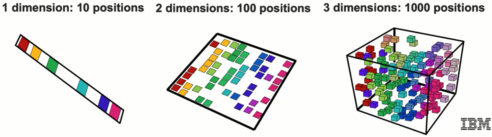

- **1 dimension** ($10$ positions): Need $6$ responses for $60\%$ coverage
- **2 dimensions** ($10 \times 10 = 100$ positions): Need $60$ responses for same coverage
- **3 dimensions** ($10 \times 10 \times 10 = 1000$ positions): Need $600$ responses for same coverage

**Mathematical relationship**: For $d$ dimensions with $m$ positions per dimension:
- Total space = $m^d$ positions
- Required samples for fixed coverage $\propto m^d$
- Exponential growth: $\mathcal{O}(m^d)$

**Additional Problems**:
- Slower computational performance
- Higher incidence of outliers
- Need massive amounts of training data (often unavailable)

### Real-World Example: Customer Churn Dataset
- Original: 54 columns/features
- Problems:
  - Related features (age, under_30, senior_citizen)
  - Duplicated features (latitude)
- Solutions:
  - Clustering: Identify customer groups without considering churn
  - Dimensionality reduction: Improve performance and interpretability

### Unsupervised Learning Workflow

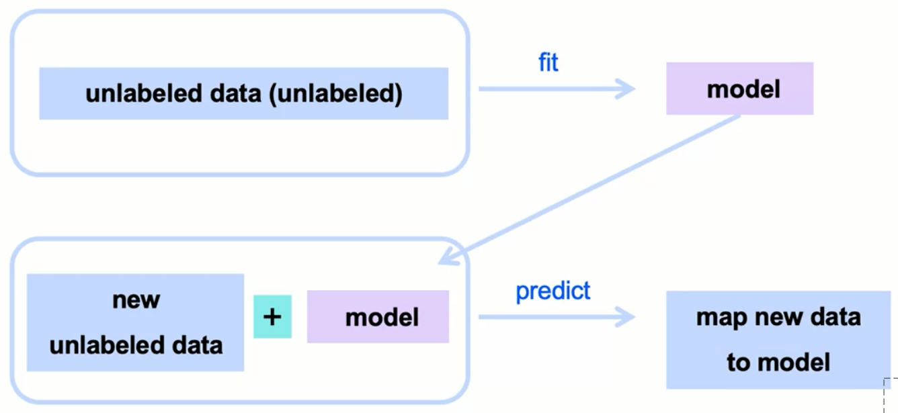

```
Unlabeled Dataset → Fit Model → Trained Model → Predict on New Unlabeled Data → Groupings/Reduced Dimensions
```

**Example - News Article Clustering**:

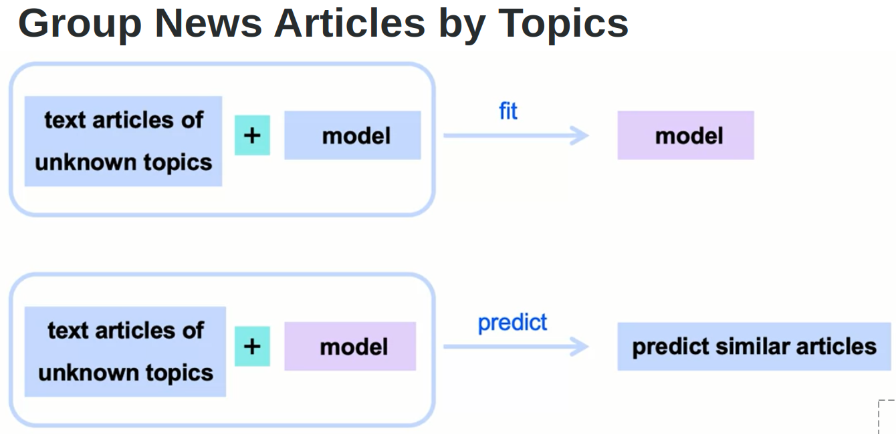

1. Start: Text articles of unknown topics
2. Fit: Create model (e.g., K-means) to find natural groupings
3. Model learns: Features/words that determine groupings
4. Apply: Use fitted model on new articles
5. Result: Predict similar articles based on original dataset patterns

## Module 2: Common Use Cases

### 1. Classification for Unlabeled Data
- Finding heterogeneous groupings when no labels exist
- Examples:
  - **Spam detection**: Finding email groupings different from normal emails (without labels)
  - **Text analysis**: Finding subgroups in product reviews

### 2. Anomaly Detection
**Example - Credit Card Fraud**:
- Detect small clusters compared to user's normal transactions
- Indicators:
  - High volume of attempts
  - Smaller transaction volumes
  - New merchants
- Result: New cluster indicates potential fraud

### 3. Customer Segmentation
**RFM Analysis** (Recency, Frequency, Monetary):
- Segment by: Recency, frequency, average amount of visits (last 3 months)
- Combine features to create distinct segments

**Demographic Segmentation**:
- Groups: Single customers, new parents, empty nesters
- Application: Determine preferred marketing channels
- Use insights for future marketing campaigns

### 4. Improving Supervised Learning
**Process**:
1. Train logistic regression on entire dataset
2. Use clustering to find data subsegments
3. Train separate models for each cluster
4. Compare performance: single model vs. multiple cluster-specific models
5. Note: No guarantee of improvement, but common practice

### Dimensionality Reduction Use Cases

#### High-Resolution Image Processing

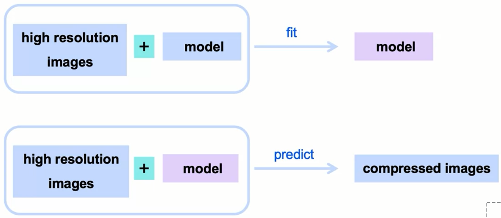

**Process**:
1. Take high-resolution images
2. Fit model to images
3. Create reduced, compact versions retaining essential information
4. Apply to new images for compression

#### Computer Vision Applications
**Image Tracking**:
- Reduce noise to primary relevant factors in video capture
- Benefits:
  - Greatly improved computational efficiency
  - Faster detection algorithms
  - Better performance in real-time applications

## Module 3: Introduction to Clustering Concepts

### Simple Clustering Example
**Scenario**: Customer segmentation based on number of site visits

#### Visual Clustering Exercise

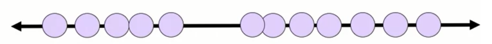

- **Feature**: Number of visits
- **Task**: Segment users into groups

**Different Cluster Options**:
1. **Two clusters**: Natural visual separation

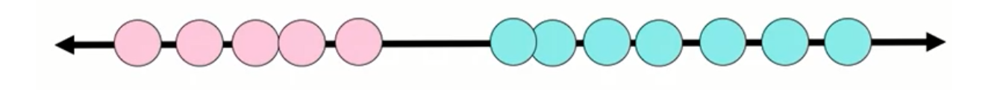

2. **Three clusters**: More granular segmentation

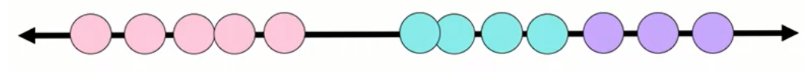

3. **Five clusters**: Fine-grained customer groups

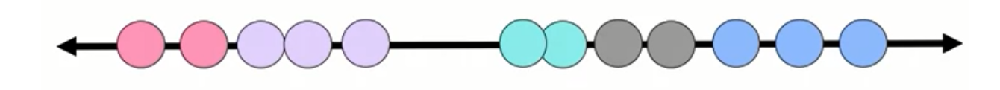

## Module 4: K-Means Algorithm

### Algorithm Overview
**K-Means**: First unsupervised machine learning algorithm for clustering

### How K-Means Works

#### K-Means Objective Function
The algorithm minimizes the within-cluster sum of squares (WCSS):

$$J = \sum_{i=1}^{k} \sum_{\mathbf{x} \in C_i} \|\mathbf{x} - \boldsymbol{\mu}_i\|^2$$

Where:
- $J$ = objective function to minimize
- $k$ = number of clusters
- $C_i$ = set of points in cluster $i$
- $\boldsymbol{\mu}_i$ = centroid of cluster $i$

#### Example Setup
- **Features**: 
  1. Number of previous site visits
  2. Recency (how recently customer visited)
- **Goal**: Find 2 clusters ($K=2$)

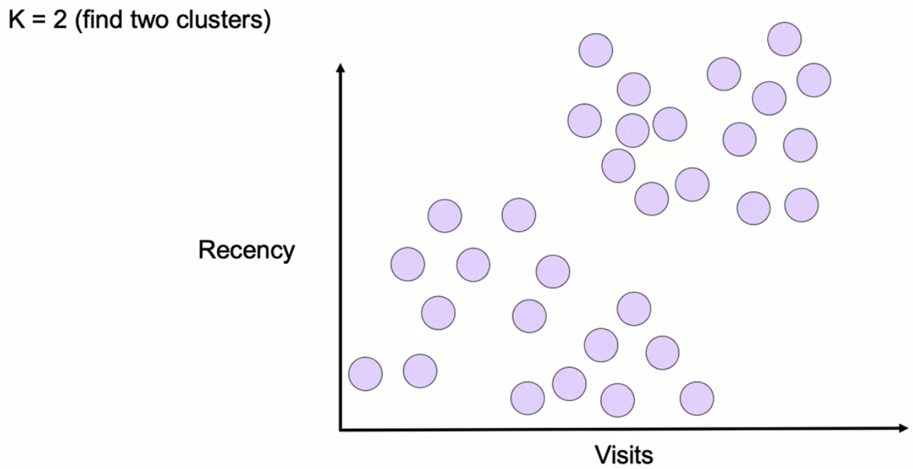

#### Algorithm Steps

**Step 1: Initialization**
- Pick $K$ random points as initial centroids: $\boldsymbol{\mu}_1^{(0)}, \boldsymbol{\mu}_2^{(0)}, ..., \boldsymbol{\mu}_k^{(0)}$
- Example: 2 centroids (blue and pink) for $K=2$

.png)

**Step 2: Assignment Phase**
- For each data point $\mathbf{x}_j$:
  - Calculate distance to all centroids: $d_{ij} = \|\mathbf{x}_j - \boldsymbol{\mu}_i\|$
  - Assign to nearest centroid: $c_j = \arg\min_i d_{ij}$
- Result: All points now belong to a cluster

.png)

**Step 3: Update Phase**
- Calculate new centroid positions
- New position for cluster $i$: 
  $$\boldsymbol{\mu}_i^{(t+1)} = \frac{1}{|C_i|} \sum_{\mathbf{x} \in C_i} \mathbf{x}$$
- Where $|C_i|$ is the number of points in cluster $i$

.png)

**Step 4: Iteration**
- Repeat Steps 2-3 until convergence
- **Convergence criterion**: 
  $$\|\boldsymbol{\mu}_i^{(t+1)} - \boldsymbol{\mu}_i^{(t)}\| < \epsilon \quad \forall i$$
- Where $\epsilon$ is a small threshold (e.g., $10^{-4}$)
- Centroids stop moving = algorithm has converged

.png)

.png)

.png)

.png)

### Convergence Example
**Iteration 1**:
- Initial random centroids
- Assign points to nearest centroid
- Move centroids to cluster means

**Iteration 2**:
- Reassign points based on new centroids
- Update centroid positions again

**Iteration 3**:
- Points reassigned
- Centroids don't move anymore = CONVERGED
- Algorithm found visual structure automatically

### Multiple Solutions Problem
**For K=3, multiple valid solutions exist**:
- Different initial points → Different final clusters
- All solutions are "converged" (centroids don't move)
- Problem: Algorithm sensitive to initial point choice
- Different initializations yield different results

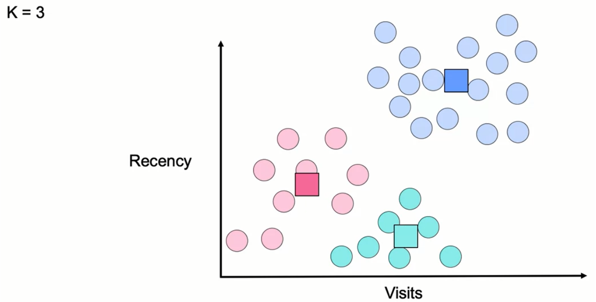

.png)

.png)

## Module 5: K-Means++ Smart Initialization

### The Local Optima Problem
- K-means may converge to different clusters each run
- Process review:
  1. Take K centroids
  2. Find nearest points
  3. Calculate average of assigned points
  4. Set average as new centroid
  5. Repeat until no movement

**Issue**: Need way to judge and rank converged results by "goodness"

### Why Local Optima Occur
- **Main cause**: Two cluster centroids initialized close together
- Close initialization → suboptimal solutions
- **Solution**: Initialize points far apart

### K-Means++ Algorithm

**Goal**: Smarter initialization to avoid local optima

#### Step 1: First Centroid
- Pick random initial point (as before)

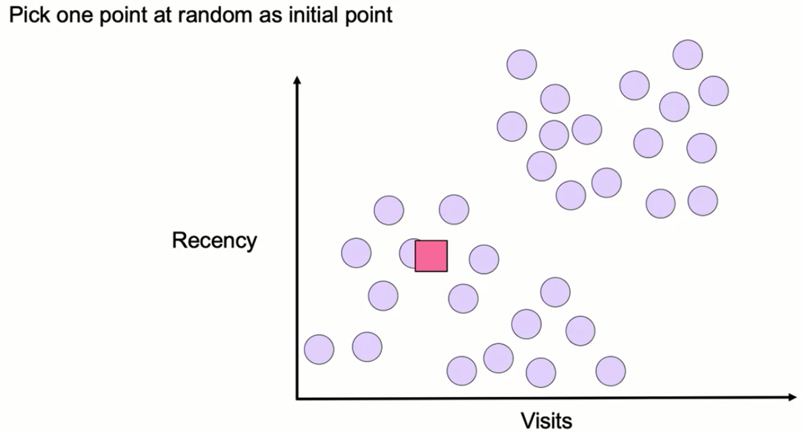

#### Step 2: Second Centroid Selection
**Instead of random, use probability-based selection**:

**Formula**:

$$P(\text{point}) = \frac{d^2(\text{point})}{\sum_{i=1}^{n} d^2(\text{point}_i)}$$

Where:
- $d^2(\text{point})$ = squared distance from point to first centroid
- $\sum_{i=1}^{n} d^2(\text{point}_i)$ = sum of all squared distances from all points to the centroid

**Effect**: Far-away points have higher probability of selection

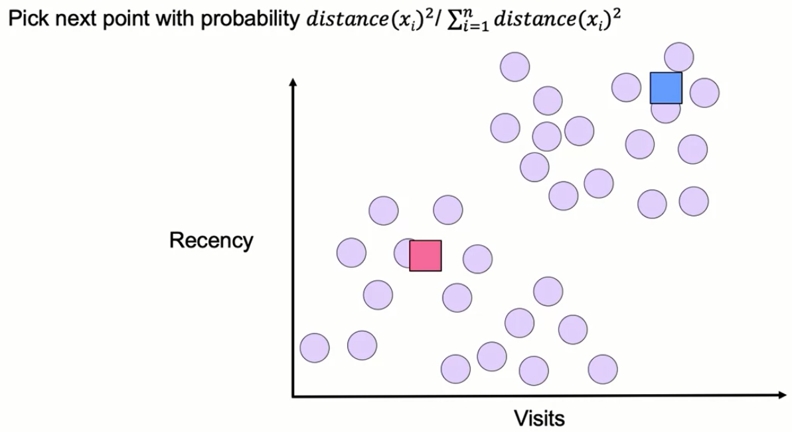

#### Step 3: Third Centroid (for K=3)
**Distance calculation changes**:

$$d = \min_{c \in C} \text{distance}(\text{point}, c)$$

Where $C$ is the set of existing centroids

- Use minimum distance to ANY of the two existing centroids
- Ensures new centroid is far from BOTH existing ones

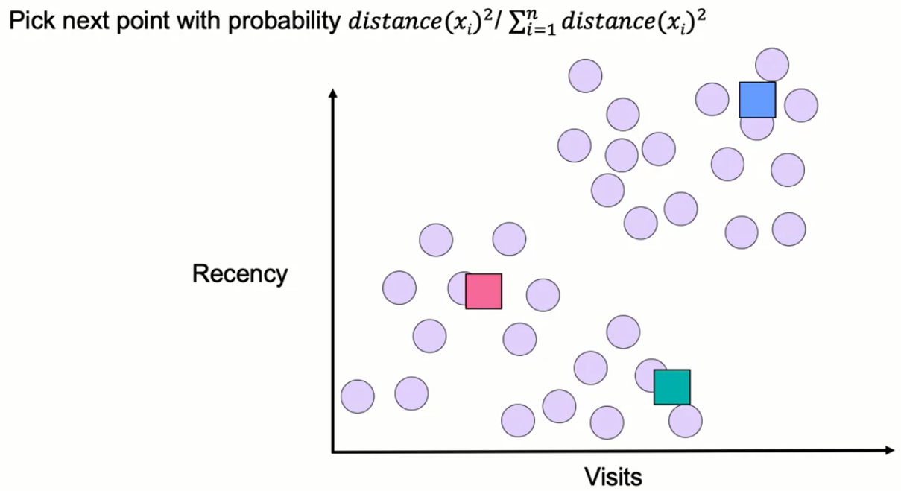

#### Step 4: Additional Centroids
- Repeat process for K centroids
- Distance = minimum distance to ALL existing centroids
- Ensures maximum separation between all centroids

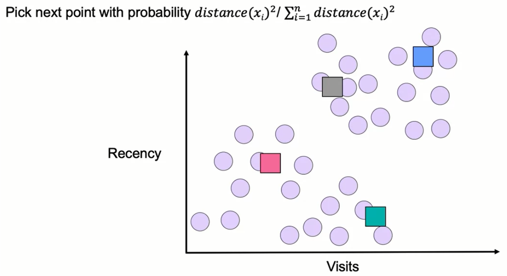

### Benefits of K-Means++
- Helps avoid getting stuck at local optima
- Default implementation in scikit-learn
- Better final clustering results
- More consistent across runs

## Module 6: Metrics for Choosing K

### When is K Predetermined?
Sometimes K is known based on business requirements:
1. **Technical constraints**: Computer has 4 cores → K=4
2. **Business requirements**: Organization needs 10 size classes
3. **UI requirements**: Navigation needs 20 disciplines → K=20

### When K is Unknown
Need metrics to select optimal number of clusters

### Metric 1: Inertia

**Definition**: Total sum of squared distances from each point to its cluster centroid

**Formula**:

$$\text{Inertia} = \sum_{i=1}^{n} \sum_{j \in C_k} \|\mathbf{x}_j - \boldsymbol{\mu}_i\|^2$$

Where:
- $n$ = number of clusters
- $C_k$ = set of points in cluster $k$
- $\mathbf{x}_j$ = data point $j$
- $\boldsymbol{\mu}_i$ = centroid of cluster $i$
- $\|\cdot\|$ = Euclidean distance

**Properties**:
- Smaller inertia = tighter clusters
- Penalizes spread-out clusters
- Rewards clusters tight to centroids

**Drawback**: 
- Sensitive to number of points in clusters
- Always increases as more points added
- Penalizes even if new points are closer than existing ones

### Metric 2: Distortion

**Definition**: Average of squared distances from each point to its cluster centroid

**Formula**:

$$\text{Distortion} = \frac{1}{n} \sum_{i=1}^{k} \sum_{j \in C_i} \|\mathbf{x}_j - \boldsymbol{\mu}_i\|^2$$

Where:
- $n$ = total number of points
- $k$ = number of clusters
- $C_i$ = set of points in cluster $i$
- $\mathbf{x}_j$ = data point $j$
- $\boldsymbol{\mu}_i$ = centroid of cluster $i$

**Properties**:
- Smaller distortion = tighter clusters
- Not necessarily increased by adding points
- Closer points can decrease average distance

### Inertia vs. Distortion Comparison

| Aspect | Inertia | Distortion |
|--------|---------|------------|
| **Measure** | Sum of squared distances | Average of squared distances |
| **Adding points** | Always increases | May decrease if points are close |
| **Use when** | Want similar cluster sizes | Want similar point density |
| **Sensitivity** | Number of points | Point similarity |

**Both metrics**:
- Measure entropy per cluster
- Decrease fairly similarly in practice
- Lower values = better clusters

### Finding Best Clustering for Given K

**Process**:
1. Run K-means multiple times with different initializations
2. Calculate inertia/distortion for each run
3. Select configuration with lowest metric

**Example with K=3**:
- Run 1: Inertia = 12.645 ← BEST

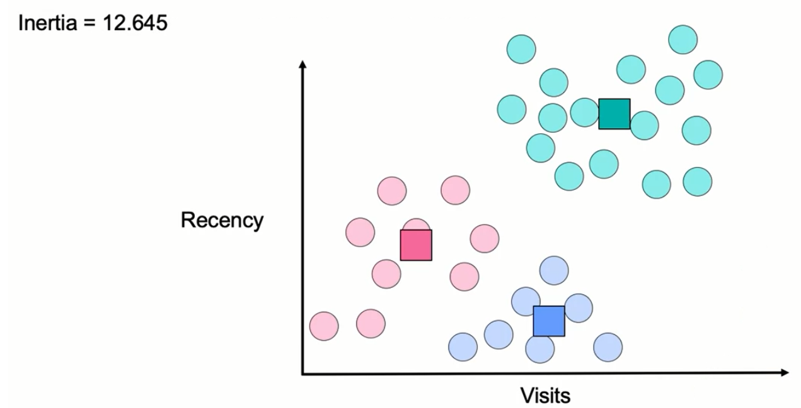

- Run 2: Inertia = 12.943

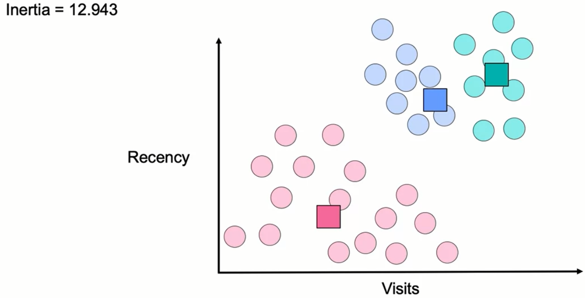

- Run 3: Inertia = 13.112

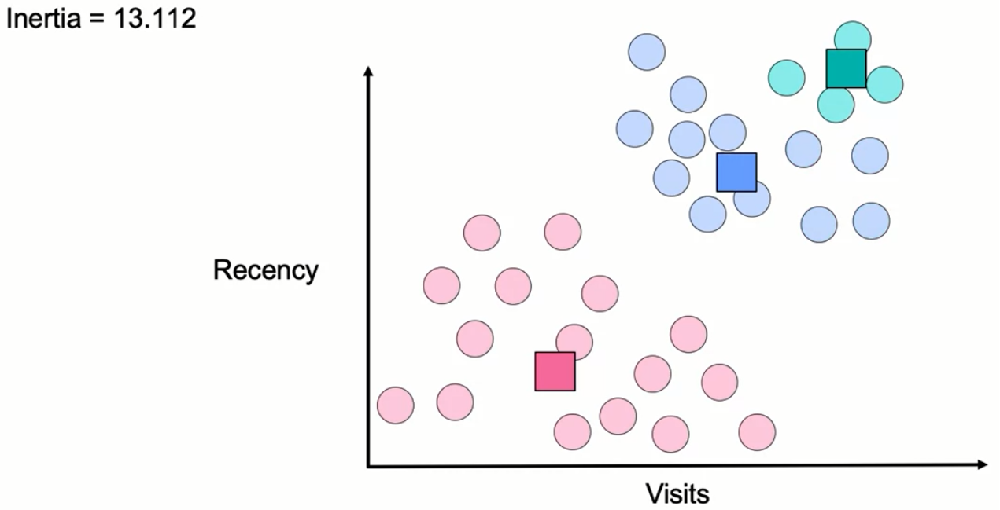

Select Run 1 configuration as optimal

## Module 7: Elbow Method and Python Implementation

### The Elbow Method

**Purpose**: Choose optimal number of clusters (K)

**Key Insight**:
- Inertia/distortion decrease as K increases
- Extreme case: K = n (each point its own cluster) → inertia = 0
- Need method to find meaningful K

#### How the Elbow Method Works

**Process**:
1. Plot K (x-axis) vs. Inertia/Distortion (y-axis)
2. Look for "elbow" - inflection point in curve
3. Before elbow: Rapid decrease in metric
4. After elbow: Rate of decrease slows dramatically
5. Elbow indicates natural number of groupings

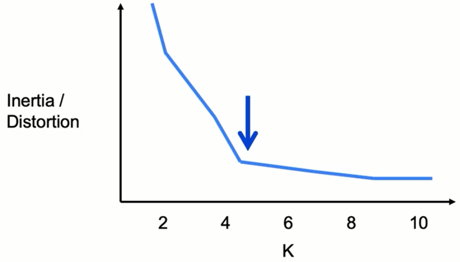

**Interpretation**:
- Slowing decrease suggests natural clustering point
- Logical choice for K
- Works with both inertia and distortion

**Metric Selection**:
- **Inertia**: Penalizes different cluster sizes → more balanced clusters
- **Distortion**: Penalizes average distance → more similar clusters

### Python Implementation

#### Basic K-Means Setup

```python
# Step 1: Import the class
from sklearn.cluster import KMeans

# Step 2: Initialize instance with hyperparameters
kmeans = KMeans(
    n_clusters=3,  # Number of clusters (we must decide)
    init='k-means++',  # Use K-means++ initialization (default)
    # Other initialization techniques available in documentation
)

# Step 3: Fit model to data
kmeans.fit(X1)

# Step 4: Predict clusters
labels = kmeans.predict(X1)  # Can predict on same data for clustering
# Note: Unlike supervised learning, predicting on same data is safe
# We're finding groupings, not overfitting to a solution
```

#### Batch Mode Option

```python
# For large datasets - use mini-batch K-Means
from sklearn.cluster import MiniBatchKMeans

# Randomly selects batches for faster computation
# Similar to K-Means but with smaller batches
# Helps speed up algorithm for large datasets
```

#### Implementing the Elbow Method

```python
# Initialize empty list for inertia values
inertias = []

# Define range of K values to test
K_range = range(1, 11)  # Test K from 1 to 10

# Fit K-Means for each K value
for K in K_range:
    # Initialize K-Means with current K
    kmeans = KMeans(n_clusters=K, init='k-means++')
    
    # Fit to data
    kmeans.fit(X1)
    
    # Get inertia attribute after fitting
    # kmeans.inertia_ contains the inertia value
    inertias.append(kmeans.inertia_)

# Plot the elbow curve
import matplotlib.pyplot as plt

plt.plot(K_range, inertias, 'bo-')  # K values on x-axis, inertias on y-axis
plt.xlabel('Number of Clusters (K)')
plt.ylabel('Inertia')
plt.title('Elbow Method For Optimal K')
plt.show()

# Look for the "elbow" in the plot to determine optimal K
```

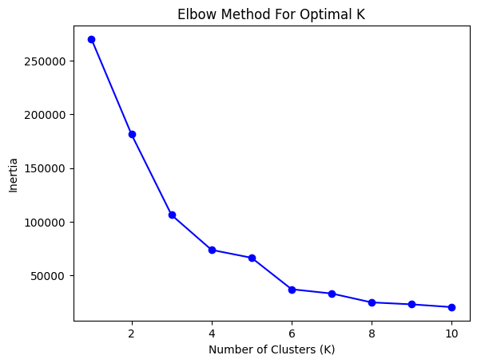

#### Key Implementation Notes

1. **First unsupervised algorithm in Python**
2. **Similar structure to supervised learning**:
   - Import class
   - Initialize with hyperparameters
   - Fit to data
   - Predict clusters
3. **Important difference**: Safe to fit and predict on same data (finding structure, not generalizing)
4. **Inertia attribute**: Available after fitting as `kmeans.inertia_`
5. **Batch mode**: Use `MiniBatchKMeans` for large datasets

### Summary Points

- Elbow method helps find optimal K
- Plot K vs. metric (inertia/distortion)
- Look for inflection point
- Python implementation follows sklearn pattern
- K-means++ is default initialization
- Can use batch processing for speed

## Summary Document Key Points

### Unsupervised Learning Overview

**When to Use**: 
- No outcome or labeled variable to predict
- Need to find structures in data
- Want to partition data into smaller pieces

### Types of Unsupervised Learning

| Type | Data Characteristics | Example Use Case | Algorithms |
|------|---------------------|------------------|------------|
| **Clustering** | Unlabeled data, identify unknown structures | Customer segmentation | K-means, HAC, DBSCAN, Mean shift |
| **Dimensionality Reduction** | Structural characteristics to simplify | Reduce size without losing info | PCA, NMF |

### Curse of Dimensionality - Detailed Issues

1. **Spurious correlations**: Correlate in training but not in new data
2. **Noise over signal**: Too many non-meaningful features
3. **Exponential training requirements**: Data needs grow exponentially
4. **Slower performance**: Computational expense increases
5. **More outliers**: Higher dimensions = more outliers
6. **Solution**: Reduce dimensions using PCA or feature selection

### K-Means Algorithm Summary

**Definition**: Iterative process grouping similar observations

**Process**:
1. Initialize K random centroids
2. Assign each point to nearest centroid
3. Recalculate centroids as mean of assigned points
4. Repeat until convergence (no reassignments)

**Advantages**: 
- Easy to compute
- Intuitive algorithm

**Disadvantages**:
- Sensitive to initialization
- Can converge to local optima

**Solution**: K-means++ for smarter initialization

### Choosing K - Metric Formulas

**Inertia**:

$$\text{Inertia} = \sum_{i=1}^{k} \sum_{j \in C_i} \|\mathbf{x}_j - \boldsymbol{\mu}_i\|^2$$

- Sum of squared distances
- Penalizes spread clusters
- Use when: Want similar cluster sizes

**Distortion**:

$$\text{Distortion} = \frac{1}{n} \sum_{i=1}^{k} \sum_{j \in C_i} \|\mathbf{x}_j - \boldsymbol{\mu}_i\|^2$$

- Average of squared distances  
- Not always increased by more points
- Use when: Want similar point density

### Finding Optimal Clustering

1. Run K-means with different initializations
2. Compare inertia/distortion values
3. Select configuration with lowest metric
4. Use elbow method to find optimal K

## Gaussian Mixture Models (GMM)

### GMM Overview

**Definition**: Probabilistic model assuming data comes from mixture of Gaussian distributions

**Key Differences from K-Means**:
- K-Means: Hard clustering (point belongs to one cluster)
- GMM: Soft clustering (probability of belonging to each cluster)

### GMM Components

1. **Gaussian Components**: Each cluster represented by Gaussian distribution
2. **Parameters per Component**:
   - Mean (μ): Center of distribution
   - Covariance (Σ): Shape and spread
   - Weight (π): Proportion of data from this component

### GMM Mathematical Model

**Probability density function**:

$$p(\mathbf{x}) = \sum_{k=1}^{K} \pi_k \cdot \mathcal{N}(\mathbf{x} | \boldsymbol{\mu}_k, \boldsymbol{\Sigma}_k)$$

Where:
- $K$ = number of Gaussian components
- $\pi_k$ = mixing coefficient (weight) of component $k$, with $\sum_{k=1}^{K} \pi_k = 1$
- $\mathcal{N}(\mathbf{x} | \boldsymbol{\mu}_k, \boldsymbol{\Sigma}_k)$ = Gaussian distribution with mean $\boldsymbol{\mu}_k$ and covariance matrix $\boldsymbol{\Sigma}_k$
- The Gaussian distribution is defined as:
  $$\mathcal{N}(\mathbf{x} | \boldsymbol{\mu}, \boldsymbol{\Sigma}) = \frac{1}{(2\pi)^{D/2}|\boldsymbol{\Sigma}|^{1/2}} \exp\left(-\frac{1}{2}(\mathbf{x} - \boldsymbol{\mu})^T \boldsymbol{\Sigma}^{-1} (\mathbf{x} - \boldsymbol{\mu})\right)$$

### Expectation-Maximization (EM) Algorithm

**Two-step iterative process**:

1. **E-step (Expectation)**:
   - Calculate probability each point belongs to each cluster
   - Responsibility: 
   $$\gamma(z_{nk}) = \frac{\pi_k \mathcal{N}(\mathbf{x}_n | \boldsymbol{\mu}_k, \boldsymbol{\Sigma}_k)}{\sum_{j=1}^{K} \pi_j \mathcal{N}(\mathbf{x}_n | \boldsymbol{\mu}_j, \boldsymbol{\Sigma}_j)}$$
   - This represents $P(\text{point } n \text{ belongs to cluster } k)$

2. **M-step (Maximization)**:
   - Update parameters based on responsibilities
   - New mean: 
   $$\boldsymbol{\mu}_k^{\text{new}} = \frac{\sum_{n=1}^{N} \gamma(z_{nk}) \mathbf{x}_n}{\sum_{n=1}^{N} \gamma(z_{nk})}$$
   - New covariance: 
   $$\boldsymbol{\Sigma}_k^{\text{new}} = \frac{\sum_{n=1}^{N} \gamma(z_{nk}) (\mathbf{x}_n - \boldsymbol{\mu}_k^{\text{new}})(\mathbf{x}_n - \boldsymbol{\mu}_k^{\text{new}})^T}{\sum_{n=1}^{N} \gamma(z_{nk})}$$
   - New mixing coefficient: 
   $$\pi_k^{\text{new}} = \frac{1}{N} \sum_{n=1}^{N} \gamma(z_{nk})$$

### GMM Advantages

1. **Flexible cluster shapes**: Can model elliptical clusters
2. **Soft clustering**: Provides probabilities, not just assignments
3. **Better for overlapping clusters**: Natural handling of uncertainty
4. **Statistical framework**: Can use likelihood for model selection

### GMM Implementation

```python
from sklearn.mixture import GaussianMixture

# Initialize GMM
gmm = GaussianMixture(
    n_components=3,  # Number of Gaussian components
    covariance_type='full',  # Type of covariance matrix
    init_params='kmeans'  # Initialize with k-means
)

# Fit model
gmm.fit(X)

# Predict cluster probabilities
probs = gmm.predict_proba(X)  # Soft clustering
labels = gmm.predict(X)  # Hard clustering

# Model selection using BIC/AIC
bic = gmm.bic(X)  # Bayesian Information Criterion
aic = gmm.aic(X)  # Akaike Information Criterion
```

### When to Use GMM vs K-Means

**Use K-Means when**:
- Clusters are roughly spherical
- Need fast computation
- Hard assignments sufficient

**Use GMM when**:
- Clusters have elliptical shapes
- Need probability estimates
- Clusters overlap
- Statistical framework needed

### Model Selection for GMM

**Information Criteria**:

- **BIC (Bayesian Information Criterion)**: 
  $$\text{BIC} = -2 \ln L + k \ln n$$
  Where:
  - $L$ = likelihood of the model
  - $k$ = number of free parameters
  - $n$ = number of data points

- **AIC (Akaike Information Criterion)**: 
  $$\text{AIC} = -2 \ln L + 2k$$
  Where parameters are the same as BIC

**Model Selection Rule**: Choose the model with the **lowest** BIC or AIC value

**Process**:
```python
# Test different numbers of components
n_components_range = range(1, 11)
bic_scores = []
aic_scores = []

for n_components in n_components_range:
    gmm = GaussianMixture(n_components=n_components)
    gmm.fit(X)
    bic_scores.append(gmm.bic(X))
    aic_scores.append(gmm.aic(X))

# Choose n_components with lowest BIC/AIC
optimal_n = n_components_range[np.argmin(bic_scores)]
```

---

## Final Notes

This comprehensive set of notes covers:
1. Unsupervised learning fundamentals
2. The curse of dimensionality
3. Common use cases for clustering and dimensionality reduction
4. K-means algorithm in detail
5. K-means++ initialization
6. Metrics for cluster evaluation (inertia and distortion)
7. The elbow method for choosing K
8. Complete Python implementation
9. Gaussian Mixture Models as an advanced alternative

Key takeaways:
- Unsupervised learning finds patterns without labels
- K-means is fundamental but has limitations
- Proper initialization (K-means++) is crucial
- Multiple metrics help evaluate clustering quality
- The elbow method helps choose optimal K
- GMM provides probabilistic alternative for complex data
