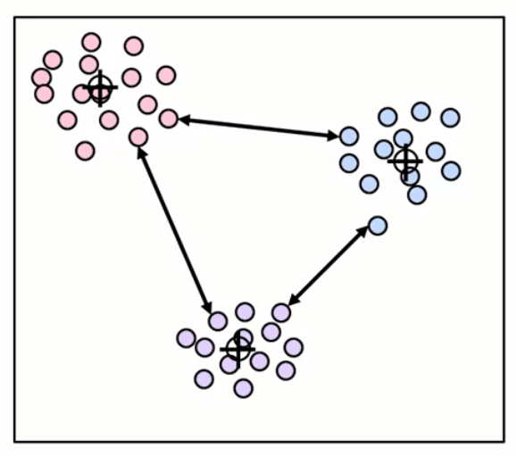
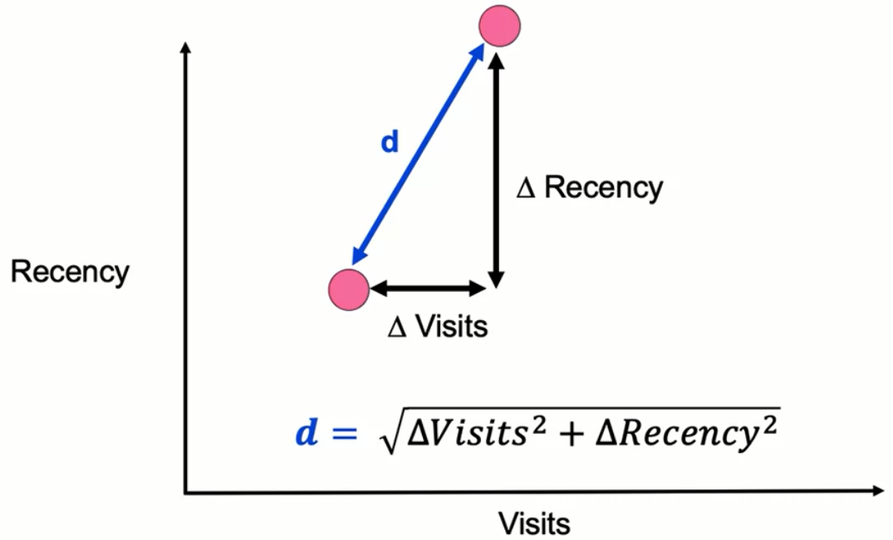
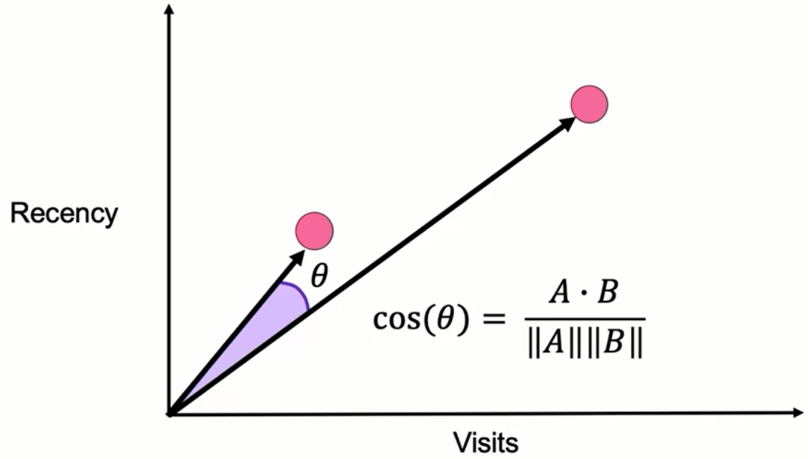
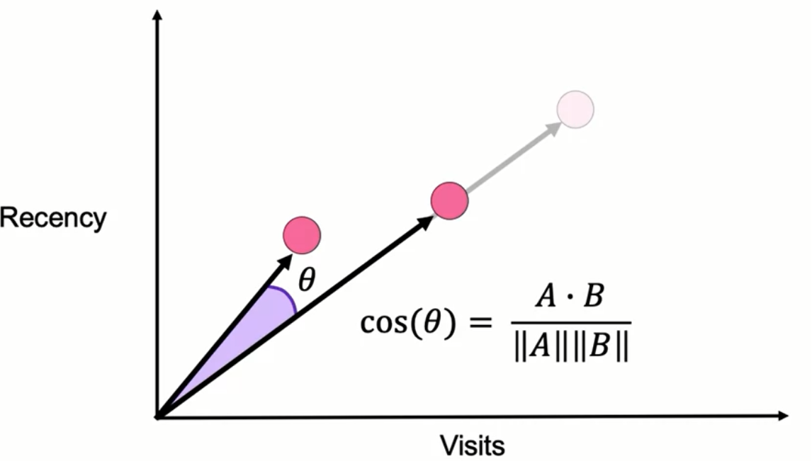

# Unsupervised Machine Learning - Module 2

## 1. Introduction to Distance Metrics

### Key Distance Metrics to Study:
1. **Euclidean Distance** (L2 distance)
2. **Manhattan Distance** (L1 distance)  
3. **Cosine Similarity**
4. **Jaccard Distance**

### Importance of Distance Metrics



- **Critical for clustering algorithms**: All clustering algorithms depend on measuring distance or similarity between points
- **Choice matters**: Different metrics have different strengths and appropriate use cases
- **Empirical evaluation needed**: Sometimes need to test multiple metrics to determine which works best for specific goals

---

## 2. Euclidean Distance (L2 Distance)

### Definition
The most intuitive distance metric, based on straight-line distance between two points.



### Mathematical Formula

For 2D space:
$$d = \sqrt{(x_2 - x_1)^2 + (y_2 - y_1)^2}$$

**General formula for n-dimensions:**
$$d(p,q) = \sqrt{\sum_{i=1}^{n}(p_i - q_i)^2}$$

Where:
- $d$ = Euclidean distance
- $p_i$ = coordinate of point p in dimension i
- $q_i$ = coordinate of point q in dimension i
- $n$ = number of dimensions

### Calculation Example
Given two points in 2D space with features:
- **Point 1**: (visits₁, recency₁)
- **Point 2**: (visits₂, recency₂)

Steps:
1. Calculate change in visits: $\Delta visits = visits_2 - visits_1$
2. Calculate change in recency: $\Delta recency = recency_2 - recency_1$
3. Apply Pythagorean theorem: $d = \sqrt{(\Delta visits)^2 + (\Delta recency)^2}$

### Key Characteristics
- Based on Pythagorean theorem: $a^2 + b^2 = c^2$
- Extends naturally to higher dimensions
- Most commonly used distance metric in k-means clustering
- Represents actual physical distance in space

### When to Use
- When actual magnitude/scale matters
- For continuous numerical data
- When you want the "as the crow flies" distance

---

## 3. Manhattan Distance (L1 Distance)

### Definition
Sum of absolute differences along each dimension (like walking in a city grid).


### Mathematical Formula

For 2D space:
$$d = |x_2 - x_1| + |y_2 - y_1|$$

**General formula for n-dimensions:**
$$d(p,q) = \sum_{i=1}^{n}|p_i - q_i|$$

Where:
- $d$ = Manhattan distance
- $p_i$ = coordinate of point p in dimension i
- $q_i$ = coordinate of point q in dimension i
- $n$ = number of dimensions

### Key Characteristics
- **Always ≥ Euclidean distance** (except when points lie on same axis)
- Named after Manhattan's grid-like street layout
- Also called "City Block" distance

### Advantages in High Dimensions
- **Better for high dimensionality**: Performs better than L2 in distinguishing distances in high-dimensional spaces
- **Curse of dimensionality**: L1 is more robust against the curse of dimensionality
- High dimensionality makes it difficult to distinguish distances between points
- L1 score better distinguishes different distances in higher dimensional space

### When to Use
- Business cases with very high dimensionality
- When movement is restricted to axes (like city blocks)
- When outliers should have linear (not quadratic) impact

---

## 4. Cosine Distance (Cosine Similarity)

### Definition
Measures the cosine of the angle between two vectors, focusing on direction rather than magnitude.



### Mathematical Formula

$$cos(\theta) = \frac{A \cdot B}{||A|| \times ||B||} = \frac{\sum_{i=1}^{n}A_i \times B_i}{\sqrt{\sum_{i=1}^{n}A_i^2} \times \sqrt{\sum_{i=1}^{n}B_i^2}}$$

**Cosine Distance:**
$$d = 1 - cos(\theta)$$

Where:
- $A \cdot B$ = dot product of vectors A and B
- $||A||$ = norm (magnitude) of vector A
- $||B||$ = norm (magnitude) of vector B
- $\theta$ = angle between the two vectors

### Key Characteristics
- **Scale insensitive**: Insensitive to scaling with respect to the origin



- **Direction matters, not magnitude**: Two points on same ray from origin have distance = 0
- **Range**: Distance values between 0 (same direction) and 2 (opposite directions)
- Points along the same ray passing through origin have distance of 0

### Visual Understanding
- Any two points on the same line through the origin have cosine distance = 0
- Example: (recency=1, visits=1) has same cosine distance to (recency=10, visits=10)
- Focuses on relationships/ratios rather than absolute distances

### Use Case Example: Text Classification

**Scenario**: Document classification based on word counts

**Features**: Counts of different words in documents

**Why Cosine Distance?**
- Longer documents naturally have higher word counts
- A summary article and full article about same topic should cluster together
- Example comparison:
  - Document A: {data_science: 3, application: 10}
  - Document B: {data_science: 30, application: 100}
  - Same ratio (1:3.33), same direction → cosine distance = 0
  - Euclidean distance would consider them far apart

### Advantages
1. **Robust against curse of dimensionality**: Better than Euclidean in high dimensions
2. **Document similarity**: Perfect for text classification where document length shouldn't affect similarity
3. **Direction-based clustering**: Groups items by proportions/ratios rather than absolute values

### When to Use
- Text data with word count features
- When scale/magnitude should be ignored
- When you care about proportions/ratios
- High-dimensional data

---

## 5. Jaccard Distance

### Definition
Measures dissimilarity between sets based on unique elements.

### Mathematical Formula

$$Jaccard Distance = 1 - \frac{|A \cap B|}{|A \cup B|}$$

$$= 1 - \frac{len(shared)}{len(unique)}$$

Where:
- $A \cap B$ = intersection (shared elements between sets A and B)
- $A \cup B$ = union (all unique elements from both sets)

### Application: Text Analysis with Unique Word Occurrence

**Example Calculation:**

**Sentence A**: "I like chocolate ice cream"
- Set A = {I, like, chocolate, ice, cream}
- Size = 5 unique words

**Sentence B**: "Do I want chocolate cream or vanilla cream"
- Set B = {Do, I, want, chocolate, cream, or, vanilla}
- Size = 7 unique words (note: "cream" counted once)

**Calculation Steps:**
1. **Intersection** (shared words): {I, chocolate, cream} = 3 words
2. **Union** (all unique words): {I, like, chocolate, ice, cream, Do, want, or, vanilla} = 9 words
3. **Jaccard Similarity**: 3/9 = 1/3
4. **Jaccard Distance**: 1 - 1/3 = 2/3 = 0.67

### Key Characteristics
- **Set-based**: Works with unique elements only
- **Range**: 0 (identical sets) to 1 (no common elements)
- **Order independent**: Position of elements doesn't matter

### When to Use
- Text documents for grouping similar topics
- Binary/categorical data
- Recommendation systems
- When presence/absence matters more than frequency

### Advantages for Text
- Simple and intuitive for word occurrence
- Good for short documents or titles
- Effective when word frequency is less important than word presence

---

## 6. Summary and Key Takeaways

### Distance Metric Comparison Table

| Metric | Formula Type | Sensitivity to Scale | Best Use Cases | Curse of Dimensionality |
|--------|--------------|---------------------|----------------|------------------------|
| **Euclidean (L2)** | $\sqrt{\sum(p_i-q_i)^2}$ | High | Continuous data, physical distance | Affected |
| **Manhattan (L1)** | $\sum\|p_i-q_i\|$ | High | High dimensions, grid movement | More robust |
| **Cosine** | Angle-based | None (scale invariant) | Text data, proportional relationships | Most robust |
| **Jaccard** | Set intersection/union | N/A (sets) | Binary data, word occurrence | N/A |

### Critical Decision Factors

1. **Data Type**:
   - Continuous numerical → Euclidean or Manhattan
   - Text/counts → Cosine or Jaccard
   - Binary/categorical → Jaccard

2. **Dimensionality**:
   - Low dimensions → Euclidean works well
   - High dimensions → Manhattan or Cosine preferred

3. **Scale Importance**:
   - Scale matters → Euclidean or Manhattan
   - Scale invariant needed → Cosine

4. **Application Context**:
   - Physical distance → Euclidean
   - Document similarity → Cosine or Jaccard
   - Grid-based movement → Manhattan

### Key Insights
- **No universal best metric**: Choice heavily depends on application
- **Empirical testing needed**: May need to evaluate multiple metrics
- **Distance affects clustering**: Different metrics produce different groupings
- **Curse of dimensionality**: High dimensions affect some metrics more than others

### Implementation Considerations
- Consider computational complexity for large datasets
- Some metrics require preprocessing (e.g., normalization)
- Combine metrics when appropriate for hybrid approaches
- Always validate clustering results with domain knowledge

---

## Practice Problems

### Problem 1: Euclidean Distance
Calculate the Euclidean distance between points P(2, 3) and Q(5, 7).

**Solution:**
$$d = \sqrt{(5-2)^2 + (7-3)^2} = \sqrt{9 + 16} = \sqrt{25} = 5$$

### Problem 2: Manhattan Distance
Calculate the Manhattan distance for the same points.

**Solution:**
$$d = |5-2| + |7-3| = 3 + 4 = 7$$

### Problem 3: Cosine Similarity
Two documents have word vectors:
- Doc1: [2, 4, 0]
- Doc2: [1, 2, 0]

Calculate cosine similarity.

**Solution:**
- Dot product: 2×1 + 4×2 + 0×0 = 10
- ||Doc1|| = $\sqrt{4+16+0}$ = $\sqrt{20}$
- ||Doc2|| = $\sqrt{1+4+0}$ = $\sqrt{5}$
- Cosine similarity = $\frac{10}{\sqrt{20} \times \sqrt{5}} = \frac{10}{10} = 1$
- Cosine distance = 1 - 1 = 0 (same direction)

### Problem 4: Jaccard Distance
Set X = {apple, banana, orange}
Set Y = {banana, orange, grape, kiwi}

Calculate Jaccard distance.

**Solution:**
- Intersection: {banana, orange} = 2 elements
- Union: {apple, banana, orange, grape, kiwi} = 5 elements
- Jaccard distance = 1 - 2/5 = 3/5 = 0.6

---

## Code Implementation Examples

### Python Implementation

```python
import numpy as np
from scipy.spatial import distance
from sklearn.metrics import jaccard_score

# Euclidean Distance
def euclidean_distance(p1, p2):
    """
    Calculate Euclidean distance between two points.
    
    Args:
        p1: First point coordinates (array-like)
        p2: Second point coordinates (array-like)
    
    Returns:
        float: Euclidean distance
    """
    return np.sqrt(np.sum((np.array(p1) - np.array(p2))**2))

# Manhattan Distance
def manhattan_distance(p1, p2):
    """
    Calculate Manhattan distance between two points.
    
    Args:
        p1: First point coordinates (array-like)
        p2: Second point coordinates (array-like)
    
    Returns:
        float: Manhattan distance
    """
    return np.sum(np.abs(np.array(p1) - np.array(p2)))

# Cosine Distance
def cosine_distance(v1, v2):
    """
    Calculate Cosine distance between two vectors.
    
    Args:
        v1: First vector (array-like)
        v2: Second vector (array-like)
    
    Returns:
        float: Cosine distance (1 - cosine similarity)
    """
    dot_product = np.dot(v1, v2)
    norm_v1 = np.linalg.norm(v1)
    norm_v2 = np.linalg.norm(v2)
    
    # Avoid division by zero
    if norm_v1 == 0 or norm_v2 == 0:
        return 1.0
    
    cosine_similarity = dot_product / (norm_v1 * norm_v2)
    return 1 - cosine_similarity

# Jaccard Distance
def jaccard_distance(set1, set2):
    """
    Calculate Jaccard distance between two sets.
    
    Args:
        set1: First set
        set2: Second set
    
    Returns:
        float: Jaccard distance
    """
    intersection = len(set1.intersection(set2))
    union = len(set1.union(set2))
    
    # Avoid division by zero
    if union == 0:
        return 0.0
    
    return 1 - (intersection / union)

# Example usage
if __name__ == "__main__":
    # Example points
    point1 = [1, 2, 3]
    point2 = [4, 5, 6]
    
    print(f"Euclidean Distance: {euclidean_distance(point1, point2):.2f}")
    print(f"Manhattan Distance: {manhattan_distance(point1, point2):.2f}")
    print(f"Cosine Distance: {cosine_distance(point1, point2):.4f}")
    
    # Example sets for Jaccard
    set_a = {"I", "like", "chocolate", "ice", "cream"}
    set_b = {"Do", "I", "want", "chocolate", "cream", "or", "vanilla"}
    print(f"Jaccard Distance: {jaccard_distance(set_a, set_b):.2f}")
```

### Using Scikit-learn

```python
from sklearn.metrics.pairwise import (
    euclidean_distances,
    manhattan_distances,
    cosine_distances
)

# Example data matrix (each row is a data point)
X = np.array([[1, 2], [3, 4], [5, 6]])

# Calculate pairwise distances
euclidean_dist_matrix = euclidean_distances(X)
manhattan_dist_matrix = manhattan_distances(X)
cosine_dist_matrix = cosine_distances(X)

print("Euclidean Distance Matrix:")
print(euclidean_dist_matrix)
```

---

## Important Notes for Clustering Applications

1. **Preprocessing**: 
   - Normalize/standardize data when using Euclidean or Manhattan
   - Already normalized for Cosine (inherent in formula)

2. **Computational Efficiency**:
   - Manhattan: Fastest (no square root)
   - Euclidean: Moderate (requires square root)
   - Cosine: Slower (requires norm calculations)

3. **Interpretability**:
   - Euclidean: Direct physical interpretation
   - Manhattan: Grid/block interpretation
   - Cosine: Angular/directional interpretation
   - Jaccard: Percentage overlap interpretation

4. **Clustering Algorithm Compatibility**:
   - K-means: Typically uses Euclidean
   - Hierarchical: Can use any metric
   - DBSCAN: Can use any metric
   - Spectral: Often uses similarity (inverse of distance)