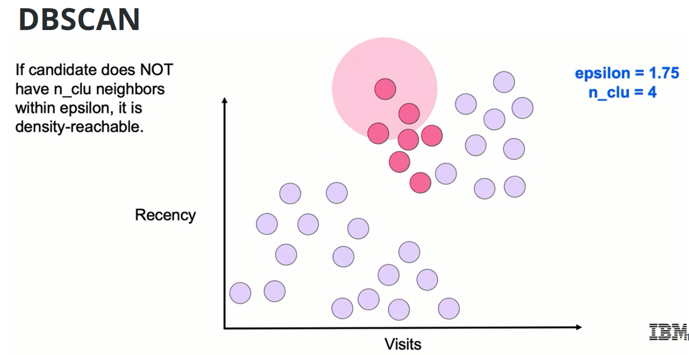
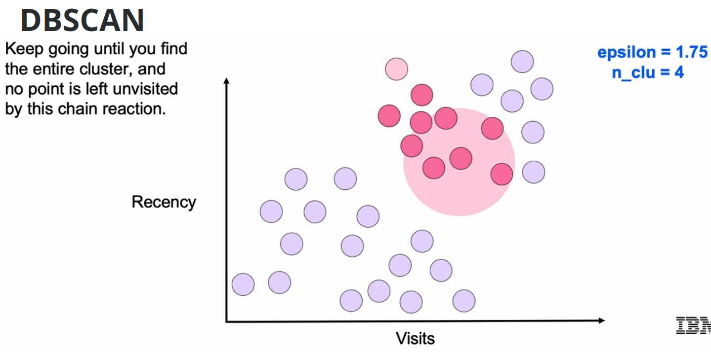
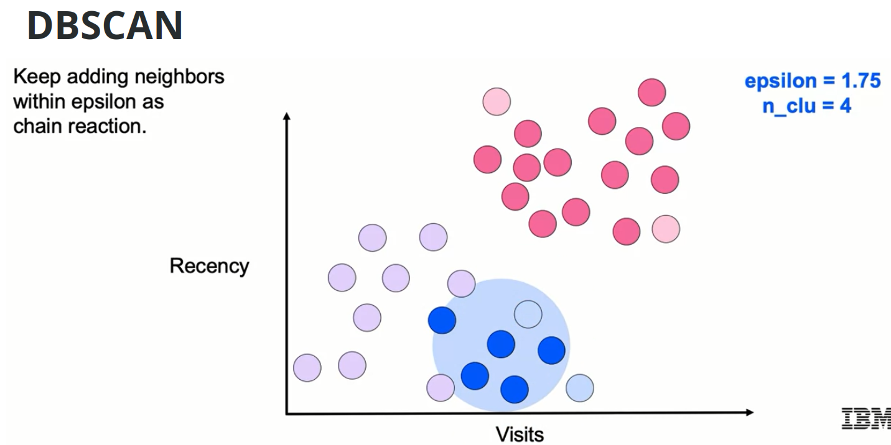

# Unsupervised Machine Learning - Module 3

## 1. Hierarchical Agglomerative Clustering

### Introduction
Hierarchical agglomerative clustering is an algorithm that continuously splits out and merges new clusters successively until reaching a level of convergence.

### How It Works

#### Starting Process
- Begin by examining all data points
- Identify the pair of points with **minimal distance**
- Distance metric selection is crucial for clustering success

#### Algorithm Steps
1. Start with each point as its own cluster
2. Find the two closest points/clusters
3. Merge them into a single cluster
4. Repeat until stopping criterion is met

**Key Point**: The next closest pair can be:
- Two individual points
- A cluster and a point
- Two clusters

#### Visual Example

Starting with a 2D dataset:


- Green points identified as closest → first pair

.png)

- Continue finding next closest pairs

.png)

.png)

- Blue and green clusters merge together

.png)

- Process continues: 6 clusters → 5 → 4 → 3 → 2 → 1

.png)

.png)

.png)

.png)

.png)

.png)

.png)

.png)

.png)

.png)

.png)

.png)

.png)

.png)

.png)

### Stopping Criteria

Since the algorithm would eventually merge everything into one cluster, we need stopping criteria:

1. **Predetermined number of clusters**
   - Stop when reaching desired cluster count
   - Example: Stop at 3 clusters

2. **Threshold-based stopping**
   - Use minimum average cluster distance
   - Stop when all average cluster distances exceed threshold

#### Threshold Example
- Start with 5 clusters, each with average distances

.png)

.png)

- Gray dotted line marks stopping threshold
- Merge light purple and magenta clusters
- New combined cluster has higher average distance

.png)

.png)

- Continue until ALL clusters have average distance above threshold

.png)

.png)

.png)

.png)

- Algorithm converges when minimum average cluster distance > threshold

### Linkage Types

Different methods to measure distance between clusters:

#### 1. Single Linkage
**Definition**: Minimum pairwise distance between clusters


**Formula**: 
$$d(C_1, C_2) = \min_{x \in C_1, y \in C_2} d(x, y)$$

**Characteristics**:
- Uses distance between two closest points
- One point from each cluster

**Pros**:
- Ensures clear separation of clusters
- Good for clusters with clear boundaries

**Cons**:
- Sensitive to noise and outliers
- Can't separate cleanly if noise exists between clusters

#### 2. Complete Linkage
**Definition**: Maximum pairwise distance between clusters


**Formula**:
$$d(C_1, C_2) = \max_{x \in C_1, y \in C_2} d(x, y)$$

**Characteristics**:
- Takes furthest distance from each cluster
- Finds smallest of these maximum distances

**Pros**:
- Better at separating clusters with noise
- Handles overlapping points better than single linkage

**Cons**:
- Tends to break apart larger existing clusters
- Depends on where maximum distance points lie

#### 3. Average Linkage
**Definition**: Average pairwise distance between clusters


**Formula**:
$$d(C_1, C_2) = \frac{1}{|C_1| \cdot |C_2|} \sum_{x \in C_1} \sum_{y \in C_2} d(x, y)$$

**Characteristics**:
- Uses cluster centroids (averages)
- Balance between single and complete linkage

**Pros/Cons**:
- Balanced approach between min and max linkage
- May still break up larger clusters
- Somewhat sensitive to noise

#### 4. Ward Linkage
**Definition**: Minimizes within-cluster sum of squares (inertia)


**Formula**:
- Computes inertia: sum of squared distances to cluster centroids
- Picks pair that minimizes total inertia value

**Characteristics**:
- Similar approach to K-means
- Tries to minimize sum of squares

**Pros/Cons**:
- Similar balance to average linkage
- Good general-purpose approach

### Python Implementation

```python
# Import the clustering class
from sklearn.cluster import AgglomerativeClustering

# Create instance with hyperparameters
agg = AgglomerativeClustering(
    n_clusters=3,           # Number of clusters to find
    affinity='euclidean',   # Distance metric
    linkage='ward'          # Linkage type
)

# Fit the model on training data
agg.fit(X1)

# Predict clusters for new data
y_predict = agg.predict(X2)
```

### Key Takeaways
- Builds clusters hierarchically from bottom up
- Useful for finding subgroups within larger groups
- Choice of linkage type significantly affects results
- Stopping criteria essential to prevent over-merging

---

## 2. DBSCAN (Density-Based Spatial Clustering of Applications with Noise)

### Introduction
DBSCAN is a density-based clustering algorithm that:
- Truly clusters data rather than just partitioning
- Identifies outliers as noise
- Works well with arbitrary cluster shapes

### Core Concept
**Assumption**: Points in a cluster should be within a certain distance from one another in a neighborhood

**Process**:
1. Randomly select points from high-density regions
2. Expand clusters by including nearby points
3. Points must be within certain distance of existing cluster points
4. Algorithm ends when no more points can be added

### Input Parameters

#### 1. Distance Metric
Defines similarity between points (e.g., Euclidean, Manhattan)

#### 2. Epsilon (ε)
- **Definition**: Maximum distance for points to be considered neighbors
- Points within ε distance can be part of same cluster
- Critical parameter for cluster formation

#### 3. N_clu (min_samples in sklearn)
- **Definition**: Minimum points for a point to be a core point
- Core point has at least N_clu neighbors (including itself)
- Example: N_clu = 3 means point needs 2 other neighbors within ε

### Point Classifications

#### 1. Core Points
- Has ≥ N_clu neighbors within ε radius
- All clusters require at least one core point
- Foundation of cluster formation

#### 2. Density Reachable (Border) Points
- Reachable from a core point
- Has < N_clu neighbors itself
- Still part of cluster if within ε of core point

#### 3. Noise Points
- Not part of any cluster
- No core points in ε neighborhood
- Labeled as outliers (-1 in sklearn)

### Algorithm Visualization

#### Step-by-Step Process
1. **Start at random point**
   - Create radius ε around point
   - Check if enough points (≥ N_clu) to start cluster
   - Example: ε = 1.75, N_clu = 4


2. **Process each new point**
   - Points within ε of core points join cluster
   - Continue expanding cluster




3. **Identify point types**
   - Core points (dark color): Have ≥ N_clu neighbors
   - Border points (light color): Near core but < N_clu neighbors
   - Noise (gray): No core points nearby





1. **Start new clusters**
   - When no neighbors left, try new unvisited point
   - Check if it's a core point
   - Begin new cluster if criteria met





### Walkthrough
```
With ε = 1.75 and N_clu = 4:
1. Pink point selected → 5 points within ε → Core point
2. Process neighbors → Add to cluster
3. Some points have only 3 neighbors → Border points
4. Continue until no more reachable points
5. Start new point (blue) → New cluster
6. Point with no core neighbors → Noise point (gray, label = -1)
```

### Strengths and Weaknesses

#### Strengths
- **No need to specify cluster count**: Automatically determines clusters
- **Handles noise**: Identifies outliers, doesn't force them into clusters
- **Arbitrary shapes**: Can find non-spherical clusters
- Follows density patterns regardless of shape

#### Weaknesses
- **Two parameters to tune**: More complex optimization
- **Difficult in high dimensions**: Parameters hard to fine-tune
- **Different densities problematic**: 
  - If one cluster has points 5 units apart
  - Another has points 1 unit apart
  - Single ε value may not work for both

### Python Implementation

```python
# Import the clustering class
from sklearn.cluster import DBSCAN

# Create instance with parameters
db = DBSCAN(
    eps=3,           # Epsilon: maximum distance
    min_samples=2    # N_clu: minimum points for core
)

# Fit on data (no separate predict method)
db.fit(X)

# Get cluster labels
labels = db.labels_
# Note: Outliers are labeled as -1
# Clusters are labeled as 0, 1, 2, ...
```

**Important**: Cannot use `db.predict()` because DBSCAN finds clusters iteratively by scanning through data points. Must include all data in `fit()`.

---

## 3. Mean Shift Clustering

### Introduction
Mean shift is a clustering algorithm that:
- Automatically determines number of clusters
- Moves toward highest density points
- Partitions points according to nearest cluster centroid

### Core Concept

**Key Difference from K-means**:
- K-means: Centroid is mean of all points in cluster
- Mean shift: Centroid is the most dense point in cluster

**Process**:
- Assigns points by moving to densest points within a window
- No need to predefine cluster count

### How It Works

#### Calculating Local Density
**Weighted Mean**: Assigns more weight to points closer to original point within window

#### Algorithm Steps
1. **Choose starting point and window size**


   - Start at random point
   - Define window (bandwidth)


2. **Calculate weighted mean in window**
   - Find densest point using weighted mean


   - New mean doesn't need to be at data point

3. **Shift window centroid**
   - Move window center to new weighted mean


   - Shift to denser point

4. **Repeat until convergence**
   - Continue steps 2-3


   - Stop when no shift occurs (mode reached)
   - Mode = local density maximum

5. **Process all data points**
   - Repeat steps 1-4 for each point


   - Points leading to same mode → same cluster


### Visualization Example

#### Process Flow
1. Start with centroid at given point
2. Sample local density within window
3. Follow gradient toward denser direction
4. Move along data points toward highest density
5. Stop at local density maximum

#### Multiple Starting Points
- Different starting points may reach same mode
- Points reaching same mode belong to same cluster
- Algorithm finds unique local maxima automatically
- Example: 4 unique local maxima → 4 clusters

### Weighted Mean Formula

$$\text{New Mean} = \frac{\sum_{x_i \in \text{window}} K(x_i - x_{prev}) \cdot x_i}{\sum_{x_i \in \text{window}} K(x_i - x_{prev})}$$

Where:
- $K()$ = Kernel function (weights by distance)
- $x_i$ = Points within window
- $x_{prev}$ = Previous mean position

**Common Kernel**: RBF (Radial Basis Function) / Gaussian
- More weight to closer points
- Less weight according to normal distribution

### Strengths and Weaknesses

#### Strengths
- **Model-free**: No assumptions about cluster number/shape
- **One parameter**: Only bandwidth to tune
- **Robust to outliers**: Window size provides protection
- **Automatic cluster detection**: No need to specify K

#### Weaknesses
- **Bandwidth dependency**: Results heavily depend on window size
- **Bandwidth selection difficult**: No easy way to determine optimal value
- **Slow implementation**: 
  - Complexity: O(mn²)
  - m = number of iterations
  - n = number of data points
  - Large datasets take significant time

### Python Implementation

```python
# Import the clustering class
from sklearn.cluster import MeanShift

# Create instance with bandwidth parameter
ms = MeanShift(bandwidth=2)  # Window size = 2

# Fit on training data
ms.fit(X1)

# Predict clusters for new data
clusters = ms.predict(X2)
```

### Key Takeaways
- Uses density-based approach with sliding windows
- Automatically finds number of clusters
- Good when cluster count unknown
- Higher complexity than K-means

---

## 4. Clustering Algorithms Comparison

### Algorithm Overview

#### K-means
- Predetermined number of clusters (K)
- Minimizes distance from centroids to points
- Favors spherical shapes
- Even-sized clusters

#### Mean Shift
- No predetermined cluster count
- Moves toward densest points iteratively
- Window-based approach
- Favors spherical shapes

#### Ward (Hierarchical Agglomerative)
- Ward linkage: minimizes combined inertia
- More flexible with different shapes
- Can be affected by noise
- Shows cluster hierarchy

#### DBSCAN
- Finds dense regions automatically
- Identifies arbitrary shapes
- Handles outliers as noise
- No predetermined cluster count

### Detailed Comparison

#### K-means

**Parameters**: 
- `n_clusters`: Number of clusters

**Scalability**:
- Very large number of samples (with MiniBatch)
- Medium number of clusters

**Characteristics**:
- Fast with MiniBatch
- Must determine K (use elbow method if unknown)
- Finds even-sized clusters
- Poor with non-spherical shapes
- Distance from centroid in all directions

**Use Cases**:
- Quick initial clustering
- Known number of clusters
- Roughly same-sized clusters needed
- General-purpose clustering


#### Mean Shift

**Parameters**: 
- `bandwidth`: Window size (difficult to tune)

**Scalability**:
- Not scalable with many samples
- Complexity increases significantly

**Characteristics**:
- No need to guess K
- Finds uneven cluster sizes
- Slow with lots of data
- Good for many clusters
- Limited to Euclidean distance
- Spherical shape preference

**Use Cases**:
- Unknown number of clusters
- Video applications
- Clusters of different densities
- When DBSCAN is hard to tune


#### Hierarchical Clustering (Ward)

**Parameters**: 
- `n_clusters`: Number of clusters
- Can visualize dendrogram to choose

**Scalability**:
- Large (not very large) number of samples
- Large number of clusters

**Characteristics**:
- Shows full hierarchy tree
- Subgroups visible
- Multiple linkage options
- Multiple distance metrics
- Slow with many observations
- High complexity

**Use Cases**:
- Need subgroup information
- Hierarchical relationships important
- Business segmentation with levels


#### DBSCAN

**Parameters**: 
- `eps`: Neighborhood size (difficult to choose)
- `min_samples`: Minimum points for core

**Scalability**:
- Very large number of samples
- Medium number of clusters

**Characteristics**:
- Finds clusters automatically
- Handles outliers
- Arbitrary shapes
- Multiple distance metrics
- Difficulty with different densities
- Risk of too many clusters if ε too small

**Use Cases**:
- Outlier detection
- Computer vision
- Unknown clusters of similar density
- Non-spherical clusters


### Selection Guidelines

#### Choose K-means when:
- You know the number of clusters
- Need fast results
- Clusters are roughly spherical
- Similar-sized clusters expected

#### Choose Mean Shift when:
- Cluster count unknown
- Different cluster densities exist
- DBSCAN tuning is difficult
- Video/image segmentation needed

#### Choose Hierarchical when:
- Subgroup relationships matter
- Need to visualize cluster hierarchy
- Business case requires multiple granularities
- Can afford higher computation time

#### Choose DBSCAN when:
- Outlier detection is important
- Arbitrary cluster shapes expected
- Clusters have similar density
- Don't know cluster count

### Performance Summary Table

| Algorithm | Speed | Cluster Shapes | Needs K? | Handles Noise | Complexity |
|-----------|-------|----------------|----------|---------------|------------|
| K-means | Fast (MiniBatch) | Spherical | Yes | No | Low |
| Mean Shift | Slow | Spherical | No | Somewhat | O(mn²) |
| Hierarchical | Slow | Flexible | Yes | Somewhat | High |
| DBSCAN | Medium | Arbitrary | No | Yes | Medium |

### Implementation Notes

All algorithms available in scikit-learn:
```python
from sklearn.cluster import (
    KMeans, 
    MeanShift, 
    AgglomerativeClustering, 
    DBSCAN
)
```

### Final Recommendations

1. **Start simple**: Try K-means first if you know K
2. **Unknown K**: Use Mean Shift or DBSCAN
3. **Complex shapes**: Use DBSCAN
4. **Hierarchy needed**: Use Agglomerative
5. **Large data**: Use K-means with MiniBatch
6. **Outliers important**: Use DBSCAN

### Key Concepts to Remember

- **Clustering**: Unsupervised learning without labels
- **Distance metrics**: Critical for all algorithms
- **Parameter tuning**: Essential for good results
- **Scalability**: Consider data size when choosing
- **Business context**: Match algorithm to use case

---

## Summary and Best Practices

### Algorithm Selection Checklist

1. **Data characteristics**:
   - Size of dataset
   - Expected cluster shapes
   - Presence of noise/outliers
   - Cluster density variations

2. **Business requirements**:
   - Need for hierarchy?
   - Known cluster count?
   - Speed requirements?
   - Outlier handling?

3. **Technical constraints**:
   - Computational resources
   - Real-time requirements
   - Interpretability needs

### Common Pitfalls to Avoid

1. **Using wrong distance metric**
2. **Not scaling features before clustering**
3. **Ignoring outliers when they matter**
4. **Forcing spherical algorithms on non-spherical data**
5. **Not validating cluster quality**

### Validation Techniques

- **Silhouette Score**: Measure cluster cohesion
- **Elbow Method**: Find optimal K for K-means
- **Dendrogram Analysis**: For hierarchical clustering
- **Visual Inspection**: When possible in 2D/3D

### Next Steps
After clustering, consider:
- Dimensionality reduction for visualization
- Feature importance analysis
- Cluster profiling and interpretation
- Model deployment and monitoring
