# Unsupervised Machine Learning - Module 4

## 1. Introduction to Dimensionality Reduction

### The Curse of Dimensionality

The curse of dimensionality refers to the phenomenon where too many features lead to worse model performance. As dimensions increase:
- Distance measures perform poorly
- Incidence of outliers increases
- Data becomes increasingly sparse

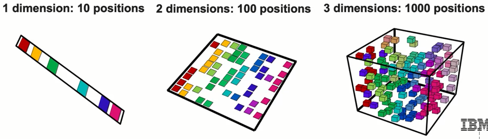

#### Mathematical Illustration of the Curse

Consider the space-filling problem:

**1-Dimensional Case:**
- Space: 10 positions
- To cover 60% of space: Need only 6 observations
- Coverage ratio: $\frac{6}{10} = 0.6$

**2-Dimensional Case:**
- Space: 10 × 10 = 100 positions
- To cover 60% of space: Need 60 observations
- Coverage ratio: $\frac{60}{100} = 0.6$

**3-Dimensional Case and Beyond:**
- Space: $10^n$ positions (where n = number of dimensions)
- Required observations grow exponentially: $0.6 \times 10^n$
- This exponential growth makes high-dimensional data extremely sparse

### Why Dimensionality Reduction?

Enterprise datasets often contain many features, but data can frequently be represented using fewer dimensions through:
1. **Feature Selection**: Selecting a subset of the most important features
2. **Feature Transformation**: Combining features using linear and non-linear transformations (PCA approach)

## 2. Principal Component Analysis (PCA) - Conceptual Foundation

### How PCA Works: A Visual Example

Consider a dataset with two features:
- **Feature 1**: Phone usage (minutes)
- **Feature 2**: Data usage (GB)

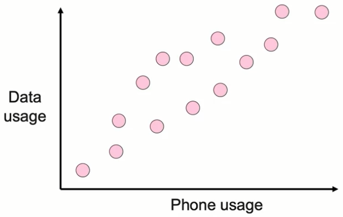

These features appear highly correlated - the data points lie close to a line in 2D space.

#### The Projection Concept

**Step 1: Identify the Line of Best Fit**
- Find a line that captures the relationship between phone and data usage
- This line represents the direction of maximum variance

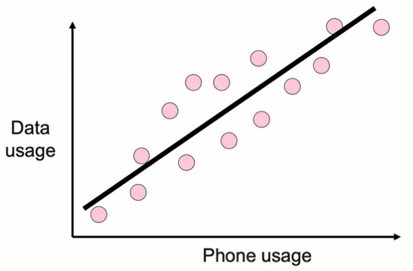

**Step 2: Project Points onto the Line**
- Each original 2D point gets projected onto the 1D line
- The projection preserves the relative distances between points along the principal direction

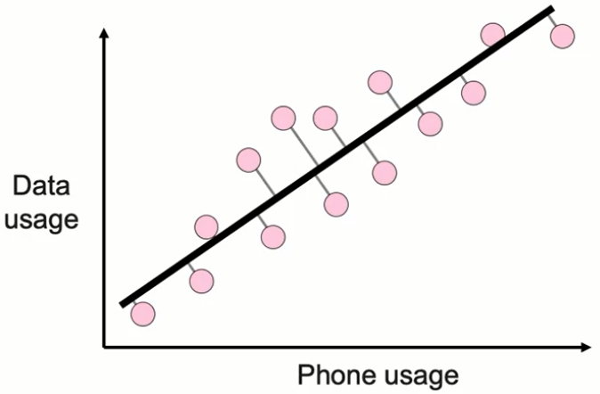

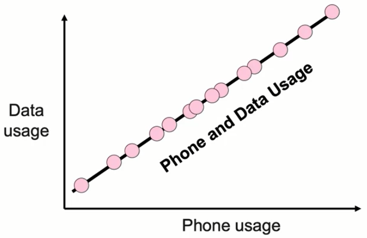

**Mathematical Representation:**
- Original space: 2 dimensions (phone_usage, data_usage)
- Transformed space: 1 dimension (combined_usage)

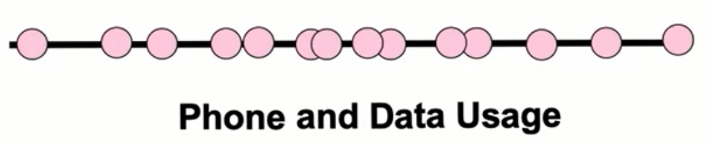

- Transformation: Linear combination of original features

$$\text{combined\_usage} = w_1 \times \text{phone\_usage} + w_2 \times \text{data\_usage}$$

Where $w_1$ and $w_2$ are weights determined by PCA to maximize variance preservation.

### Extending to Higher Dimensions

The same principle applies when reducing from:
- 3D → 2D (projecting 3D points onto a 2D plane)
- 100D → 10D (projecting high-dimensional data to lower dimensions)
- nD → kD where k < n

**Key Insight**: PCA creates new features as linear combinations of original features, intelligently selected to preserve maximum variance.

## 3. Mathematical Foundation of PCA

### Finding Principal Components

PCA identifies lines (vectors) along which to project data by finding directions of maximum variance.

#### Visualization dataset

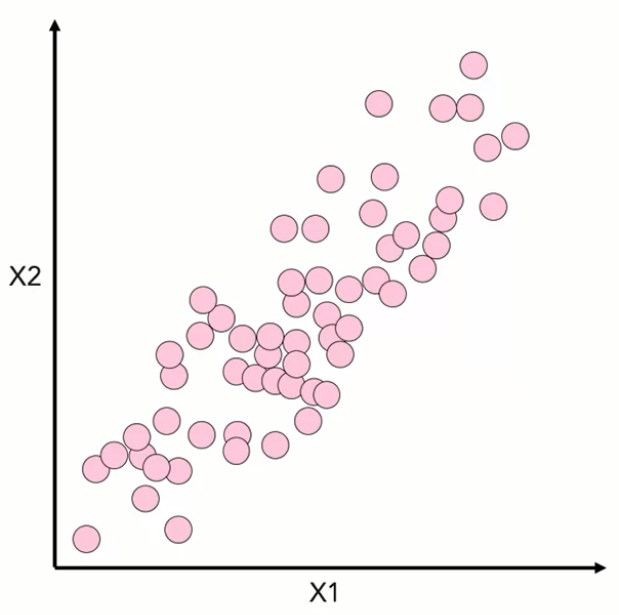

#### Primary Principal Component

For a dataset, the **primary right singular vector** (v₁):
- Accounts for maximum variance in any single direction
- Represents the most important axis of variation
- Mathematically determined using linear algebra

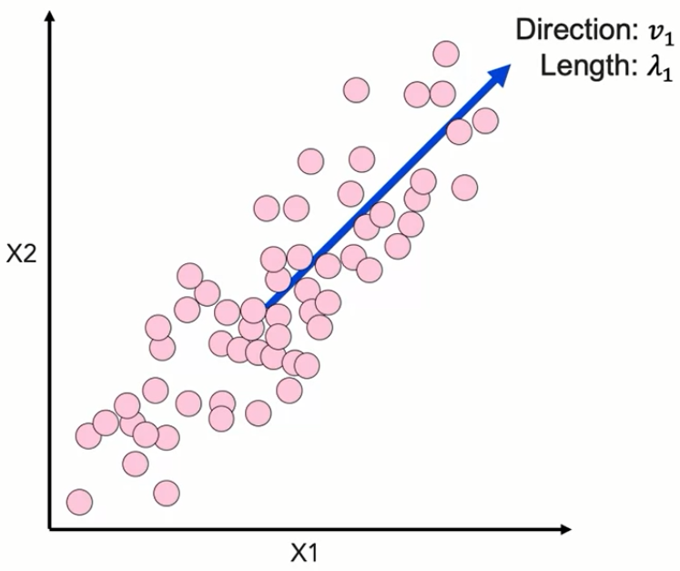

#### Secondary Principal Component

The **secondary right singular vector** (v₂):
- Perpendicular (orthogonal) to v₁
- Accounts for maximum variance among remaining directions
- Each subsequent component is orthogonal to all previous ones

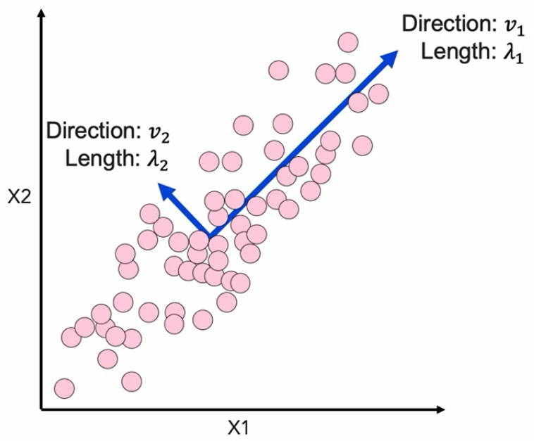

### Singular Value Decomposition (SVD)

The mathematical foundation of PCA is the Singular Value Decomposition:

$$A = U \cdot S \cdot V^T$$

Where:
- **A**: Original data matrix (m × n)
  - m = number of observations (rows)
  - n = number of features (columns)
- **U**: Left singular vectors (m × m)
  - Represents rotations in m-dimensional space
- **S**: Diagonal matrix of singular values (m × n)
  - Contains the "importance" of each component
  - Values sorted from largest to smallest
- **V**: Right singular vectors (n × n)
  - Contains the principal component directions
  - Each column is a principal component

#### Understanding the S Matrix

The diagonal matrix S stores singular values:

$$S = \begin{bmatrix}
s_1 & 0 & 0 & \cdots \\
0 & s_2 & 0 & \cdots \\
0 & 0 & s_3 & \cdots \\
\vdots & \vdots & \vdots & \ddots
\end{bmatrix}$$

Where $s_1 \geq s_2 \geq s_3 \geq \cdots$

**Interpretation**: 
- Larger singular values → More important principal components
- The ratio $\frac{s_i^2}{\sum_j s_j^2}$ gives the proportion of variance explained by component i

### Example: Decomposition of a 5×3 Matrix

Original matrix A: 5×3 (5 observations, 3 features)

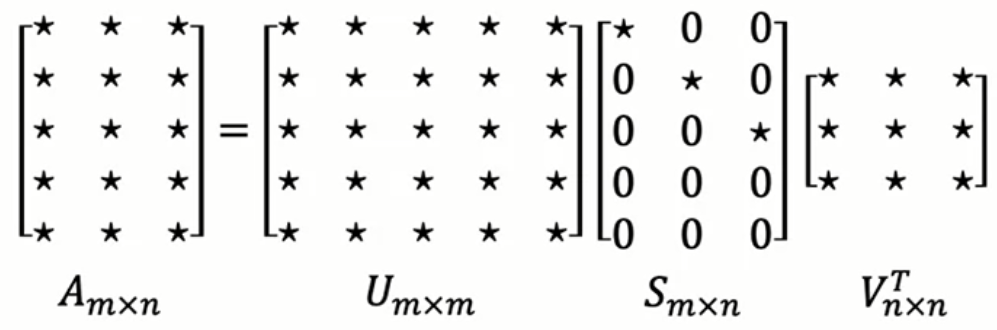

After decomposition:
- U: 5×5 matrix
- S: 5×3 diagonal matrix
- V^T: 3×3 matrix

If singular values are [9, 5, 2]:
- First component explains most variance (value = 9)
- Second component moderately important (value = 5)
- Third component least important (value = 2)

### Dimensionality Reduction Process

To reduce from n dimensions to k dimensions (k < n):

1. **Compute SVD**: $A = U \cdot S \cdot V^T$
2. **Select top k components**: Keep only first k columns of V
3. **Project data**: $A_{reduced} = A \cdot V_k$

**Mathematical transformation:**
$$A_{m \times n} \cdot V_{n \times k}^T = A_{reduced_{m \times k}}$$

Result: New matrix with same number of rows (observations) but fewer columns (k instead of n).

### Critical Note on Scaling

**WARNING**: PCA is extremely sensitive to feature scaling!

Since PCA relies on variance and distances:
- Unscaled features with larger ranges dominate the principal components
- Always standardize/normalize data before applying PCA

**Example of Scaling Impact:**
- Without scaling: PCA might project along the axis of the feature with largest absolute values
- With scaling: PCA finds the true direction of maximum variance in the normalized space

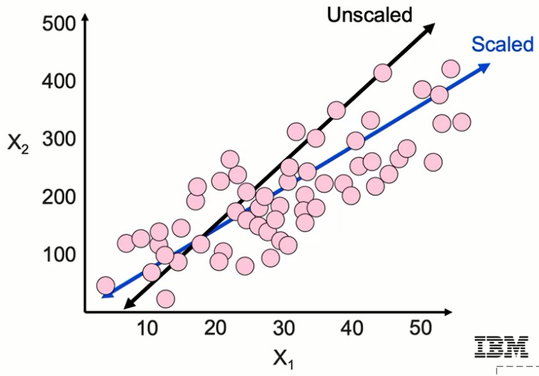

## 4. Implementing PCA with Scikit-learn

### Basic Implementation

```python
# Import necessary libraries
from sklearn.decomposition import PCA
from sklearn.preprocessing import StandardScaler
import numpy as np
import pandas as pd

# CRITICAL: Always scale your data first!
# StandardScaler ensures all features have mean=0 and std=1
scaler = StandardScaler()
X_scaled = scaler.fit_transform(X)

# Create PCA instance
# n_components: number of dimensions to reduce to
pca = PCA(n_components=3)  # Reduce to 3 dimensions

# Fit and transform the data
# fit_transform learns the principal components and projects data
X_reduced = pca.fit_transform(X_scaled)

# The transformed data now has shape (n_samples, 3)
print(f"Original shape: {X_scaled.shape}")
print(f"Reduced shape: {X_reduced.shape}")
```

### Detailed Code Explanation

```python
# Complete PCA workflow with comments

# Step 1: Import required modules
from sklearn.decomposition import PCA
from sklearn.preprocessing import StandardScaler
import numpy as np

# Step 2: Prepare your data (example with customer churn dataset)
# Assume X has 20 numeric features
print(f"Original features: {X.shape[1]}")  # Output: 20

# Step 3: CRUCIAL - Scale the data
# This ensures no single feature dominates due to its scale
scaler = StandardScaler()
X_scaled = scaler.fit_transform(X)
# Each feature now has mean=0 and standard deviation=1

# Step 4: Initialize PCA
pca = PCA(n_components=3)  # We want to reduce from 20 to 3 dimensions

# Step 5: Fit PCA to learn principal components
pca.fit(X_scaled)
# This computes the SVD and identifies the top 3 principal components

# Step 6: Transform the data
X_transformed = pca.transform(X_scaled)
# Each row is now represented by 3 values instead of 20

# Alternative: Steps 5 & 6 combined
X_transformed = pca.fit_transform(X_scaled)

# Step 7: Examine the results
print(f"Explained variance ratio: {pca.explained_variance_ratio_}")
# Shows how much variance each component captures
# Example output: [0.45, 0.25, 0.15] 
# Means PC1 explains 45%, PC2 explains 25%, PC3 explains 15% of variance

print(f"Total variance explained: {sum(pca.explained_variance_ratio_):.2%}")
# Example: 85% - means we retained 85% of information with just 3 components!

# Step 8: Access the principal components (loadings)
print(f"Components shape: {pca.components_.shape}")  # (3, 20)
# Each row is a principal component (linear combination of original features)
```

### Understanding PCA Attributes

```python
# Key attributes after fitting PCA

# 1. components_ : The principal component vectors
print(pca.components_)  
# Shape: (n_components, n_features)
# Each row is a unit vector defining a principal component

# 2. explained_variance_ : Variance explained by each component
print(pca.explained_variance_)
# The actual variance values (eigenvalues)

# 3. explained_variance_ratio_ : Proportion of variance explained
print(pca.explained_variance_ratio_)
# Normalized version - sums to ≤ 1.0

# 4. singular_values_ : The singular values from SVD
print(pca.singular_values_)
# Related to explained variance by: var = (singular_value²) / (n_samples - 1)

# 5. mean_ : Per-feature empirical mean
print(pca.mean_)
# The mean of each feature (used for centering)
```

## 5. Real-World Application: Image Compression with PCA

### Setting Up Image Data for PCA

Consider a grayscale image that we want to compress:


#### Data Preparation Process

1. **Divide image into grids**:
   - Each grid: 12×12 pixels = 144 pixels total
   - Each pixel: Single brightness value (0-255 for grayscale)

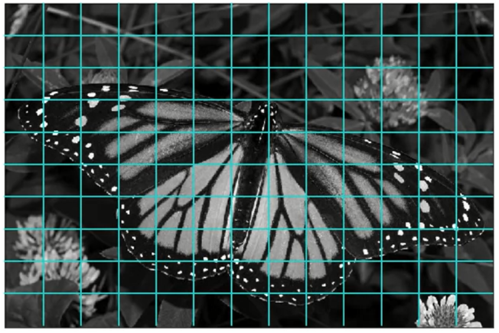

2. **Convert grids to observations**:
   - Each 12×12 grid becomes one row in the dataset
   - Unravel the 2D grid into a 1D vector of 144 features
   
   ```python
   # Conceptual transformation
   # Original grid: 12×12 matrix
   grid = [[pixel_11, pixel_12, ..., pixel_1_12],
           [pixel_21, pixel_22, ..., pixel_2_12],
           ...
           [pixel_12_1, ..., pixel_12_12]]
   
   # Unraveled to 1D: 144-element vector
   row_vector = [pixel_11, pixel_12, ..., pixel_12_12]
   ```

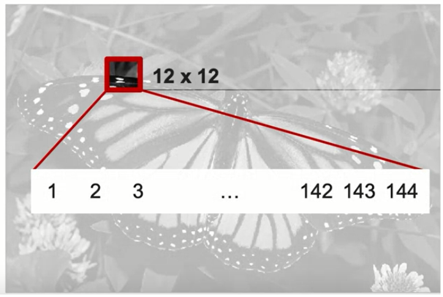

3. **Create data matrix**:
   - Rows: Number of grids in image
   - Columns: 144 (one per pixel in each grid)
   - Matrix shape: (n_grids × 144)

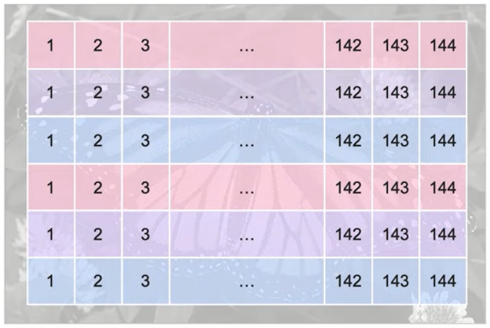

### Applying PCA for Compression

```python
# Pseudocode for image compression with PCA

# 1. Prepare image data
image_matrix = prepare_image_grids(image)  # Shape: (n_grids, 144)

# 2. Apply PCA with different compression levels
compressions = [60, 16, 4, 1]  # Number of components to keep

for n_components in compressions:
    # Fit PCA
    pca = PCA(n_components=n_components)
    compressed = pca.fit_transform(image_matrix)
    
    # Compressed shape: (n_grids, n_components)
    print(f"Compression from 144 to {n_components} dimensions")
    
    # Reconstruct image
    reconstructed = pca.inverse_transform(compressed)
    
    # Calculate reconstruction error
    error = np.mean((image_matrix - reconstructed) ** 2)  # L2 error
    print(f"Reconstruction error: {error}")
```

### Compression Results Analysis

#### 144 → 60 Dimensions (58% compression)
- Each grid represented by 60 values instead of 144
- Image remains very clear
- Minimal visual quality loss


#### 144 → 16 Dimensions (89% compression)
- Dramatic reduction in data size
- Image still recognizable and clear
- Slight loss of fine details


#### 144 → 4 Dimensions (97% compression)
- Severe compression
- Image somewhat recognizable
- Major loss of detail but general structure preserved

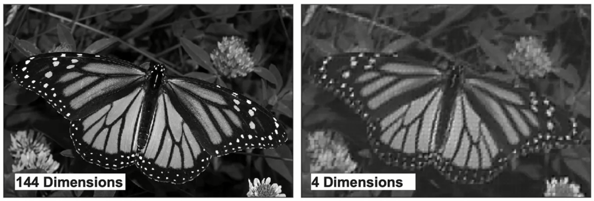

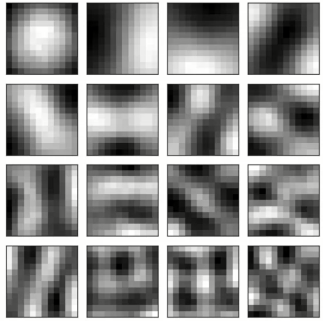

#### 144 → 1 Dimension (99% compression)
- Extreme compression
- Only fuzzy outline visible
- Each grid represented by single weight value

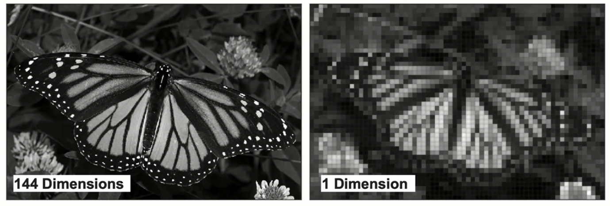

### Understanding Principal Components in Images

When reducing to 16 dimensions, the 16 principal components represent:
- **Fundamental patterns** in the image
- **Building blocks** that can reconstruct any 12×12 grid
- **Ordered by importance**: First component captures most common pattern

Each original 12×12 grid is reconstructed as:
$$\text{Grid} = w_1 \cdot PC_1 + w_2 \cdot PC_2 + ... + w_{16} \cdot PC_{16}$$

Where:
- $PC_i$ = i-th principal component (a 12×12 pattern)
- $w_i$ = weight for i-th component (specific to each grid)

### L2 Reconstruction Error

The quality of compression is measured using L2 (Euclidean) error:

$$L2\_Error = \sqrt{\sum_{i=1}^{n} (original_i - reconstructed_i)^2}$$

```python
# Calculate L2 error between original and compressed image
def calculate_l2_error(original, reconstructed):
    """
    Calculate L2 error between original and reconstructed images
    
    Parameters:
    - original: Original image matrix
    - reconstructed: Reconstructed image after PCA compression
    
    Returns:
    - L2 error (scalar)
    """
    difference = original - reconstructed
    squared_diff = difference ** 2
    mse = np.mean(squared_diff)  # Mean Squared Error
    l2_error = np.sqrt(mse)       # Root Mean Squared Error
    
    return l2_error
```

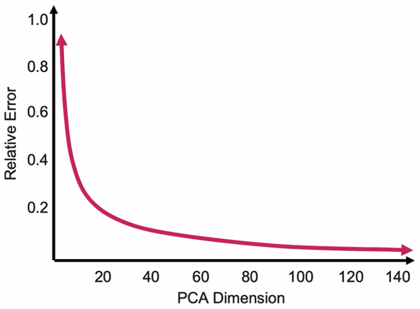

### Key Observations from Image Compression

1. **Variance Distribution**: Most image variance captured by few components
2. **Diminishing Returns**: First components provide most benefit
3. **Error vs Compression Trade-off**: Exponential relationship between compression and error
4. **Practical Applications**: 
   - Image storage optimization
   - Faster image transmission
   - Preprocessing for computer vision models

## 6. Important Considerations and Best Practices

### When to Use PCA

**Good Use Cases:**
- High-dimensional data (text, images)
- Features are continuous and roughly linear relationships exist
- Need for visualization (reduce to 2D/3D)
- Preprocessing to reduce computational complexity
- Removing multicollinearity

**Poor Use Cases:**
- Categorical data without proper encoding
- Non-linear relationships dominate
- Interpretability is crucial (PCA creates abstract features)
- Very few features already (< 10)

### PCA Limitations

1. **Linearity**: Only captures linear relationships
2. **Interpretability**: New features are abstract combinations
3. **Sensitivity to Scaling**: Requires careful preprocessing
4. **Variance ≠ Importance**: High variance doesn't always mean high predictive power

### Choosing Number of Components

```python
# Method 1: Preserve specific variance threshold
pca = PCA(n_components=0.95)  # Keep 95% of variance
pca.fit(X_scaled)
print(f"Components needed for 95% variance: {pca.n_components_}")

# Method 2: Elbow method - plot explained variance
import matplotlib.pyplot as plt

pca_full = PCA()
pca_full.fit(X_scaled)

# Cumulative explained variance plot
cumsum_var = np.cumsum(pca_full.explained_variance_ratio_)
plt.plot(range(1, len(cumsum_var) + 1), cumsum_var)
plt.xlabel('Number of Components')
plt.ylabel('Cumulative Explained Variance')
plt.axhline(y=0.95, color='r', linestyle='--', label='95% threshold')
plt.legend()
plt.show()

# Method 3: Domain knowledge
# Choose based on downstream task requirements
```

### Alternative: Non-negative Matrix Factorization (NMF)

While PCA allows negative values in components, NMF constrains all values to be non-negative:

```python
from sklearn.decomposition import NMF

# NMF for non-negative data only
nmf = NMF(n_components=5, init='random', random_state=42)
W = nmf.fit_transform(X)  # X must be non-negative
H = nmf.components_

# Reconstruction: X ≈ W × H
# Both W and H contain only non-negative values
```

**NMF Applications:**
- Text mining (word counts are non-negative)
- Image processing (pixel intensities are non-negative)
- Parts-based representation (additive components only)

## 7. Summary and Key Takeaways

### Core Concepts Mastered

1. **Dimensionality Reduction Purpose**: 
   - Combat curse of dimensionality
   - Reduce computational complexity
   - Enable visualization
   - Remove noise and redundancy

2. **PCA Mechanism**:
   - Finds directions of maximum variance
   - Projects data onto principal components
   - Creates new features as linear combinations
   - Preserves relative distances in reduced space

3. **Mathematical Foundation**:
   - Singular Value Decomposition (SVD): $A = U \cdot S \cdot V^T$
   - Principal components from V matrix
   - Importance determined by singular values in S
   - Orthogonality ensures no redundancy

4. **Practical Implementation**:
   - Always scale data before PCA
   - Choose components based on variance explained
   - Monitor reconstruction error
   - Consider interpretability trade-offs

### Key Formulas Reference

| Formula | Description |
|---------|-------------|
| $A = U \cdot S \cdot V^T$ | Singular Value Decomposition |
| $A_{reduced} = A \cdot V_k$ | Dimensionality reduction transformation |
| $\text{Variance Explained} = \frac{s_i^2}{\sum_j s_j^2}$ | Proportion of variance for component i |
| $L2 = \sqrt{\sum_i (x_i - \hat{x}_i)^2}$ | Reconstruction error |

### Final Implementation Checklist

- Import required libraries (PCA, StandardScaler)
- Prepare and clean data
- **Scale/normalize features** (critical!)
- Determine optimal number of components
- Fit PCA model
- Transform data to reduced dimensions
- Evaluate variance explained
- Assess reconstruction error if needed
- Use transformed features for downstream tasks

### Closing Remarks

PCA represents a powerful technique for handling high-dimensional data, offering a mathematically rigorous approach to dimensionality reduction while preserving the essential structure of your data. By understanding both the intuition and mathematics behind PCA, you can effectively apply it to compress images, visualize complex datasets, and improve machine learning model performance.
