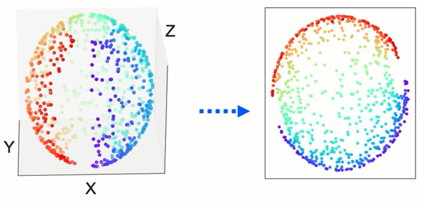

# Unsupervised Machine Learning - Module 5

## 1. Introduction to Nonlinear Transformations

### Moving Beyond Linear Methods

**Key Concept:** Linear transformations can only capture linear relationships in data. They create new features as linear combinations of the original features.

### The Challenge with Nonlinear Features

Real-world data often contains nonlinear features and structures. When we attempt to apply linear PCA to data with nonlinear relationships, our dimensionality reduction can fail to preserve the important structure of the data.

**Important Learning Point:** When data has nonlinear features and we try to perform standard PCA, we may not be able to maintain the variance while reducing the number of dimensions effectively.

**Example from the lecture:** Consider a dataset being mapped from two dimensions to two principal components (which doesn't change the space in this case). However, when mapping from higher dimensions to lower dimensions with nonlinear features present, linear PCA fails to maintain variance effectively.


---

## 2. Kernel Principal Component Analysis (Kernel PCA)

### Theoretical Foundation

Kernel PCA extends traditional PCA by using kernel functions to handle nonlinear transformations. This technique draws inspiration from Support Vector Machines (SVMs).


**Connection to SVMs:** Just as in Support Vector Machines, kernel functions map data to a higher-dimensional space. This might seem counterintuitive since our goal is dimensionality reduction, but the key insight is:

1. **First step:** Map to higher-dimensional space using kernel functions to uncover nonlinear structures
2. **Second step:** Apply linear PCA in this higher-dimensional space to reduce dimensions

**Mathematical Intuition:**
- Original space: $\mathbf{x} \in \mathbb{R}^d$ (with nonlinear relationships)
- Kernel mapping: $\phi: \mathbb{R}^d \rightarrow \mathcal{H}$ (to higher-dimensional feature space)
- Kernel function: $k(\mathbf{x}_i, \mathbf{x}_j) = \langle \phi(\mathbf{x}_i), \phi(\mathbf{x}_j) \rangle$
- Apply PCA in feature space $\mathcal{H}$ to find principal components


### How Kernel PCA Works

The process transforms curved or nonlinear data structures into a space where they become linearly separable or where linear PCA can be effectively applied.

**Example from lecture:** Data with curvature that cannot maintain total variance using direct linear PCA can be transformed using a kernel. After the kernel transformation maps the data to a linear space, we can reduce it to lower dimensions without losing the information that would be lost by applying linear projection directly.


### Available Kernel Types

Kernel PCA supports different kernel functions, similar to SVMs:
- **Linear kernel:** $k(\mathbf{x}_i, \mathbf{x}_j) = \mathbf{x}_i^T \mathbf{x}_j$
- **Polynomial kernel:** $k(\mathbf{x}_i, \mathbf{x}_j) = (\gamma \mathbf{x}_i^T \mathbf{x}_j + r)^d$
- **RBF (Gaussian) kernel:** $k(\mathbf{x}_i, \mathbf{x}_j) = \exp(-\gamma ||\mathbf{x}_i - \mathbf{x}_j||^2)$
- **Sigmoid kernel:** $k(\mathbf{x}_i, \mathbf{x}_j) = \tanh(\gamma \mathbf{x}_i^T \mathbf{x}_j + r)$
- **Cosine kernel:** $k(\mathbf{x}_i, \mathbf{x}_j) = \frac{\mathbf{x}_i^T \mathbf{x}_j}{||\mathbf{x}_i|| \cdot ||\mathbf{x}_j||}$

### The Gamma Parameter

**Gamma ($\gamma$)** is a crucial hyperparameter that controls the complexity of the nonlinear transformation:
- **Small gamma:** Results in less complex, smoother decision boundaries
- **Large gamma:** Creates more complex, curved boundaries that can capture intricate nonlinear patterns
- **Effect:** Determines how "curvy" or complex the transformation will be regarding the nonlinearity of the original dataset

### Python Implementation of Kernel PCA

```python
# Import the required class for Kernel PCA
from sklearn.decomposition import KernelPCA

# Initialize the KernelPCA object with parameters
kernel_pca = KernelPCA(
    n_components=2,        # Number of components to keep
    kernel='rbf',          # Type of kernel to use ('linear', 'poly', 'rbf', 'sigmoid', 'cosine')
    gamma=10,              # Kernel coefficient (controls nonlinearity complexity)
    fit_inverse_transform=True,  # Optional: allows reconstruction
    alpha=0.1              # Optional: regularization parameter
)

# Fit and transform the data in one step
X_kernel_pca = kernel_pca.fit_transform(X_train)
# X_kernel_pca now contains the transformed dataset with reduced dimensions

# Alternative: fit and transform separately
kernel_pca.fit(X_train)  # Learn the transformation
X_transformed = kernel_pca.transform(X_test)  # Apply to new data
```

**Code Explanation:**
- `n_components`: Specifies how many principal components to retain after transformation
- `kernel`: Chooses the kernel function for nonlinear mapping
- `gamma`: Controls the influence of single training examples (kernel width)
- `fit_transform()`: Combines fitting the model to data and transforming it in one operation

### Important Characteristics of Kernel PCA

1. **No explicit feature map:** The kernel trick allows us to work in high-dimensional space without explicitly computing the transformation $\phi(\mathbf{x})$
2. **Computational efficiency:** Despite working in high dimensions, kernel computations remain tractable
3. **May not give perfect reconstruction:** Unlike linear PCA, inverse transformation may be approximate

---

## 3. Manifold Learning

### Introduction to Manifold Learning

Manifold learning represents another class of nonlinear dimensionality reduction techniques. These methods assume that high-dimensional data lies on or near a lower-dimensional manifold embedded in the higher-dimensional space.

---

## 4. Multidimensional Scaling (MDS)

### Core Concept

**Multidimensional Scaling (MDS)** differs fundamentally from PCA in its objective:
- **PCA Goal:** Preserve maximum variance in the data
- **MDS Goal:** Preserve geometric distances between data points

**Mathematical Foundation:**
MDS minimizes the stress function:
$$\text{Stress} = \sqrt{\sum_{i<j} (d_{ij} - \delta_{ij})^2}$$

Where:
- $d_{ij}$ = distance between points $i$ and $j$ in the original space
- $\delta_{ij}$ = distance between points $i$ and $j$ in the reduced space

### Types of MDS

**Metric MDS:**
- Preserves actual numerical distances between points
- Minimizes a distance metric directly
- Determines embeddings by minimizing the stress function

**Non-Metric MDS:**
- Preserves only the rank order of distances
- Applies a monotonic transformation $f(.)$ to distances before minimization
- More flexible but less precise than metric MDS

### Geometric Interpretation

**Example from lecture:** A sphere in three dimensions is mapped to a disk in two dimensions. The algorithm attempts to maintain the distances between each point from the 3D sphere as it projects them onto the 2D disk.



This preservation of distances means that points that were close together in the original space remain close in the reduced space, and points that were far apart remain distant.

### Python Implementation of MDS

```python
# Import the MDS class from sklearn
from sklearn.manifold import MDS

# Create an instance of MDS with specified parameters
embedding = MDS(
    n_components=2,           # Number of dimensions for the embedding
    dissimilarity='precomputed',  # or 'euclidean' for computing distances
    random_state=0,           # For reproducibility
    n_components=2,           # Target number of dimensions
    metric=False              # False for non-metric MDS
)

# Fit and transform the data
X_mds = embedding.fit_transform(X_train)
# X_mds now has only 2 columns/features while preserving distances

# Alternative for precomputed distance matrix
# distance_matrix = compute_distances(X_train)  # User-defined function
# X_mds = embedding.fit_transform(distance_matrix)
```

**Code Explanation:**
- `n_components`: Specifies the target dimensionality of the embedding
- `dissimilarity`: Whether to compute distances or use precomputed distance matrix
- `metric`: Boolean flag to choose between metric and non-metric MDS
- The resulting `X_mds` maintains geometric relationships while reducing dimensions

---

## 5. Other Popular Manifold Learning Methods

### Isomap (Isometric Mapping)

**Key Concept:** Isomap extends MDS by using geodesic distances (distances along the manifold) rather than Euclidean distances.

**Algorithm Process:**
1. Construct a neighborhood graph using k-nearest neighbors
2. Compute shortest paths between all pairs of points (geodesic distances)
3. Apply classical MDS to the geodesic distance matrix

**Characteristics:**
- Maintains nearest neighbor ordering
- Better captures the intrinsic geometry of nonlinear manifolds
- Effective for data lying on curved surfaces

**Mathematical Foundation:**
- Approximates geodesic distance: $d_G(i,j) = \min_{\text{path}} \sum_{k \in \text{path}} ||\mathbf{x}_k - \mathbf{x}_{k+1}||$
- Preserves global geometric properties

### t-SNE (t-Distributed Stochastic Neighbor Embedding)

**Key Concept:** t-SNE focuses on preserving local neighborhood structure while allowing global structure to be more flexible.

**Objective:**
- Keep similar points close together in the embedded space
- Push dissimilar points further apart
- Particularly effective for visualization (2D or 3D)

**Mathematical Approach:**
1. Convert distances to probabilities in high-dimensional space:
   $$p_{j|i} = \frac{\exp(-||\mathbf{x}_i - \mathbf{x}_j||^2/2\sigma_i^2)}{\sum_{k \neq i}\exp(-||\mathbf{x}_i - \mathbf{x}_k||^2/2\sigma_i^2)}$$

2. Use Student's t-distribution in low-dimensional space:
   $$q_{ij} = \frac{(1 + ||\mathbf{y}_i - \mathbf{y}_j||^2)^{-1}}{\sum_{k \neq l}(1 + ||\mathbf{y}_k - \mathbf{y}_l||^2)^{-1}}$$

3. Minimize Kullback-Leibler divergence between $P$ and $Q$

**Characteristics:**
- Excellent for visualization and cluster identification
- Non-parametric and non-linear
- Computationally intensive for large datasets
- Perplexity parameter balances local vs. global structure

---

## 6. Practical Considerations and Best Practices

### Choosing the Right Method

**General approach recommended in the lecture:** Try several decomposition methods and evaluate their effectiveness.

**Decision Framework:**
1. **Data characteristics:**
   - Linear relationships → Standard PCA
   - Nonlinear relationships → Kernel PCA or manifold learning
   - Distance preservation important → MDS
   - Visualization needed → t-SNE

2. **Computational resources:**
   - Large datasets → Consider computational complexity
   - Real-time requirements → Simpler methods may be necessary

3. **Interpretability needs:**
   - PCA components have clear interpretations
   - Nonlinear methods may be harder to interpret

### Evaluation Strategy

**For 2D or 3D reductions:**
- Use Exploratory Data Analysis (EDA) and visualization
- Assess cluster quality and separation
- Check variance preservation (for PCA-based methods)
- Evaluate distance preservation (for MDS-based methods)

**Quantitative Metrics:**
- **Reconstruction error:** For methods supporting inverse transformation
- **Stress (for MDS):** Measures distance preservation quality
- **Explained variance ratio (for PCA):** Proportion of variance retained
- **Silhouette score:** For cluster quality assessment

### Implementation Tips

1. **Data preprocessing:**
   - Standardize features before applying dimensionality reduction
   - Handle missing values appropriately
   - Consider outlier detection and treatment

2. **Hyperparameter tuning:**
   - Use cross-validation for parameter selection
   - Grid search or random search for optimal parameters
   - Monitor computational time vs. performance trade-offs

3. **Validation:**
   - Split data into train/test sets
   - Ensure transformation learned on training data generalizes
   - Check stability across different random initializations

---

## Summary of Key Learnings

1. **Linear vs. Nonlinear:** Linear methods (PCA, SVD) fail when data has nonlinear structures. Kernel methods and manifold learning address this limitation.

2. **Kernel PCA:** Extends PCA using kernel functions to handle nonlinear relationships by implicitly mapping to higher dimensions before applying linear PCA.

3. **MDS Focus:** Unlike PCA which preserves variance, MDS preserves geometric distances between points.

4. **Method Selection:** Different methods suit different data characteristics and objectives. Experimentation with multiple approaches is recommended.

5. **Practical Implementation:** All methods are readily available in scikit-learn with similar API patterns (fit, transform, fit_transform).

6. **Visualization:** For understanding results, reducing to 2-3 dimensions and visualizing is invaluable for assessing the quality of dimensionality reduction.