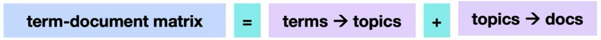
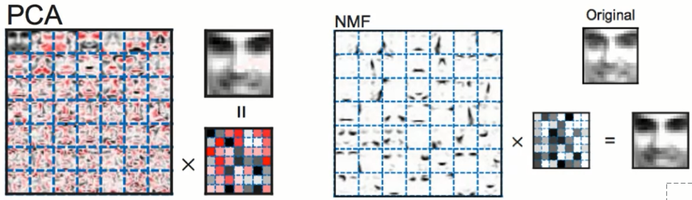

# Non-Negative Matrix Factorization (NMF) - Detailed Machine Learning Notes

## 1. Introduction to Non-Negative Matrix Factorization

### Core Concept
Non-Negative Matrix Factorization (NMF) is a dimensionality reduction technique that decomposes an original matrix containing only positive values into two matrices, both also containing only positive values.

**Mathematical Representation:**
$$V \approx W \times H$$

Where:
- $V$ = Original matrix (only positive values)
- $W$ = Basis matrix (only positive values)  
- $H$ = Coefficient matrix (only positive values)
- Dimensions: If $V$ is $m \times n$, then $W$ is $m \times k$ and $H$ is $k \times n$
- $k$ = Number of components/topics (chosen by user)

### Input Requirements
- **Only positive values as input**
- Common examples:
  - Word counts in documents
  - Pixel intensities in images
  - Any data where negative values don't make physical sense

## 2. Term-Document Matrix Decomposition

### Matrix Structure for Text Data
When applying NMF to text documents:



**Original Matrix V (Term-Document Matrix):**
- **Rows**: Individual documents
- **Columns**: Words/terms in vocabulary
- **Values**: Word counts or other word measures (e.g., TF-IDF)

**Decomposition Results:**
- **W Matrix**: How terms compose different topics
  - Dimensions: (n_documents × n_topics)
  - Interpretation: Document-topic distribution
- **H Matrix**: How to combine topics to recreate original documents
  - Dimensions: (n_topics × n_terms)
  - Interpretation: Topic-term distribution

### Key Point from Example
The number of topics is a hyperparameter chosen by the user, similar to choosing the number of components in PCA.

## 3. Comparison with PCA

### PCA Characteristics
- Transforms high dimensions to lower dimensions
- Creates new features as combinations of original features
- Original features are lost in the process
- Components are often difficult to interpret (weird combinations of features)
- Can use both positive and negative values
- Maintains orthogonality constraint

### NMF Advantages for Interpretability
- **Only additive combinations** (no subtraction since all values are positive)
- Components tend to have **intuitive meaning**
- Example from facial recognition:
  - Different components represent: eyes shading, eyebrows, nose, etc.
  - These features add together to recreate the face
  - Each component represents a recognizable part of the whole

### Mathematical Constraint Difference
```
PCA: Can have negative values → Features can cancel each other out
NMF: Only positive values → Features can only add together (no cancellation)
```



## 4. Applications of NMF

NMF has proven powerful for various applications:

1. **Word and vocabulary recognition**
2. **Image processing problems**
3. **Text mining**
4. **Transcription processes**
5. **Cryptic encoding and decoding**
6. **Decomposition of non-interpretable data objects:**
   - Video processing
   - Music analysis
   - Image analysis

## 5. Why Focus on Positive-Only Decomposition?

### Key Advantages

1. **No Feature Cancellation**
   - Since NMF only works with positive values, it cannot undo the application of a latent feature
   - No canceling out with negative values → purely additive
   - Each included feature must be important (cannot be canceled later)

2. **Interpretable Features**
   - Only positive values lead to features that may be interpretable
   - Features must all add together to recreate original data
   - Example: In face dataset → nose + ears + eyes + mouth = complete face

### Important Limitations

1. **Information Loss with Truncation**
   - If decomposition produces negative values, algorithm automatically truncates to zero
   - May not maintain as much original information as PCA
   - Formula for truncation: $\text{value} = \max(0, \text{computed\_value})$

1. **No Orthogonality Constraint**
   - Unlike PCA, no constraint for orthogonal vectors
   - Decomposition can have portions pointing in similar directions in n-dimensional space
   - This can lead to redundancy but also more flexibility

## 6. NMF for Natural Language Processing

### Input Preprocessing for Documents

Two main approaches for converting text to numeric values:

1. **Count Vectorizer**
   - Simple word counts
   - Each value = frequency of word in document

2. **TF-IDF (Term Frequency-Inverse Document Frequency)**
   - Weighted word importance
   - Formula: $\text{TF-IDF} = \text{TF} \times \log(\frac{N}{DF})$
   - Where:
     - TF = Term frequency in document
     - N = Total number of documents
     - DF = Document frequency (number of documents containing the term)
   - Gives less weight to common words (a, the, is)

### Tunable Parameters

1. **Number of topics** (main hyperparameter)
2. **Text preprocessing options:**
   - Remove stop words
   - Remove frequent terms
   - Stemming/lemmatization choices

### NLP Output Interpretation

**Two output matrices provide:**
1. **W Matrix**: How different terms relate to different topics
2. **H Matrix**: How to use topics to reconstruct original documents

## 7. Python Implementation with scikit-learn

### Complete Implementation Code

```python
# Import the NMF class from scikit-learn
from sklearn.decomposition import NMF

# Create an instance of NMF class with parameters
nmf = NMF(
    n_components=5,        # Number of topics/components to extract
    init='random',         # Initialization method ('random' or 'nndsvd')
    random_state=42        # For reproducibility
)

# Fit the model to the data
# X should be your term-document matrix (only positive values)
nmf.fit(X)

# Transform the data to the new representation
# Returns the document-topic matrix (W)
W = nmf.transform(X)

# Alternative: Fit and transform in one step
W = nmf.fit_transform(X)

# Access the components (topic-term matrix H)
H = nmf.components_

# Reconstruct the original matrix (approximately)
X_reconstructed = W @ H  # Matrix multiplication
```

### Important Implementation Notes

1. **Initialization Sensitivity**
   - Method is sensitive to initialization type
   - Results are not necessarily unique
   - Different random seeds can produce different decompositions

2. **Common initialization methods:**
   - `'random'`: Random initialization (most common)
   - `'nndsvd'`: Non-negative Double Singular Value Decomposition
   - `'nndsvda'`: NNDSVD with zeros filled with average
   - `'nndsvdar'`: NNDSVD with zeros filled with random values

### Example: Complete NMF Pipeline for Text

```python
from sklearn.feature_extraction.text import CountVectorizer, TfidfVectorizer
from sklearn.decomposition import NMF
import numpy as np

# Sample documents
documents = [
    "The cat sat on the mat",
    "The dog played in the park",
    "Cats and dogs are pets"
]

# Step 1: Convert text to numeric matrix
# Option A: Using Count Vectorizer
count_vectorizer = CountVectorizer(
    max_features=100,      # Limit vocabulary size
    stop_words='english'   # Remove common English words
)
X_counts = count_vectorizer.fit_transform(documents)

# Option B: Using TF-IDF
tfidf_vectorizer = TfidfVectorizer(
    max_features=100,
    stop_words='english'
)
X_tfidf = tfidf_vectorizer.fit_transform(documents)

# Step 2: Apply NMF
n_topics = 2  # Choose number of topics

nmf_model = NMF(
    n_components=n_topics,
    init='random',
    random_state=42,
    max_iter=200  # Maximum iterations for convergence
)

# Fit and transform the data
W = nmf_model.fit_transform(X_tfidf)  # Document-topic matrix
H = nmf_model.components_              # Topic-term matrix

# Step 3: Interpret results
# Get feature names (words)
feature_names = tfidf_vectorizer.get_feature_names_out()

# Display top words for each topic
for topic_idx, topic in enumerate(H):
    top_words_idx = topic.argsort()[-5:][::-1]  # Top 5 words
    top_words = [feature_names[i] for i in top_words_idx]
    print(f"Topic {topic_idx}: {', '.join(top_words)}")

# Check reconstruction error
reconstruction_error = np.linalg.norm(X_tfidf - W @ H, 'fro')
print(f"Reconstruction error: {reconstruction_error:.4f}")
```

## 8. Selecting Dimensionality Reduction Methods - Decision Rules

### Method Selection Guide

| **Method** | **When to Use** | **Key Characteristics** |
|------------|-----------------|-------------------------|
| **PCA** | - Linear relationships between features<br>- Goal: Preserve variance<br>- Need orthogonal components | - Creates linear combinations<br>- Can use positive and negative values<br>- Components may not be interpretable |
| **Kernel PCA** | - Nonlinear relationships between features<br>- Goal: Preserve variance in transformed space | - Handles nonlinear patterns<br>- More computationally expensive<br>- Still maintains variance |
| **MDS (Multidimensional Scaling)** | - Goal: Preserve distances between points<br>- Visualization of clusters<br>- Distance relationships more important than variance | - Focus on maintaining pairwise distances<br>- Good for cluster visualization<br>- Different optimization criterion than PCA |
| **NMF** | - Only positive input values<br>- Need interpretable components<br>- Working with:<br>  • Word matrices<br>  • Image data<br>  • Count data | - Additive parts-based representation<br>- More interpretable features<br>- Cannot handle negative values |

### Decision Flow Example
```
Start → Data has only positive values?
         ├─ Yes → Need interpretable features?
         │         ├─ Yes → Use NMF
         │         └─ No → Consider PCA (if variance important)
         └─ No → Linear relationships?
                   ├─ Yes → Use PCA
                   └─ No → Use Kernel PCA
```

## 9. Key Learning Points Summary

### Mathematical Foundation
- **Core equation**: $V \approx WH$ where all matrices contain only non-negative values
- **Dimensionality reduction**: From $m \times n$ matrix to $(m \times k) \times (k \times n)$ where $k < \min(m, n)$

### Unique Properties of NMF
1. **Constraint**: Non-negativity (all values ≥ 0)
2. **Result**: Parts-based, additive representation
3. **Interpretation**: Features represent actual parts that combine additively
4. **Trade-off**: More interpretable but potentially less variance preserved than PCA

### Practical Considerations
1. **Initialization matters**: Results depend on starting values
2. **Not unique**: Different runs may produce different valid decompositions
3. **Parameter tuning**: Number of components is crucial
4. **Preprocessing important**: For text, choice between count vectorizer and TF-IDF affects results

### When NMF Excels
- Document clustering and topic modeling
- Facial recognition with interpretable parts
- Any domain where features naturally combine additively
- Situations requiring interpretable dimensionality reduction

### Limitations to Remember
1. Cannot handle negative values (truncates to zero)
2. No orthogonality guarantee (features may overlap)
3. Sensitive to initialization
4. May lose more information than PCA due to non-negativity constraint

---

## Final Note
NMF provides a powerful alternative to PCA when working with non-negative data and when interpretability is crucial. The trade-off between maintaining variance (PCA) and achieving interpretable, additive features (NMF) should guide the choice of method based on the specific application requirements.